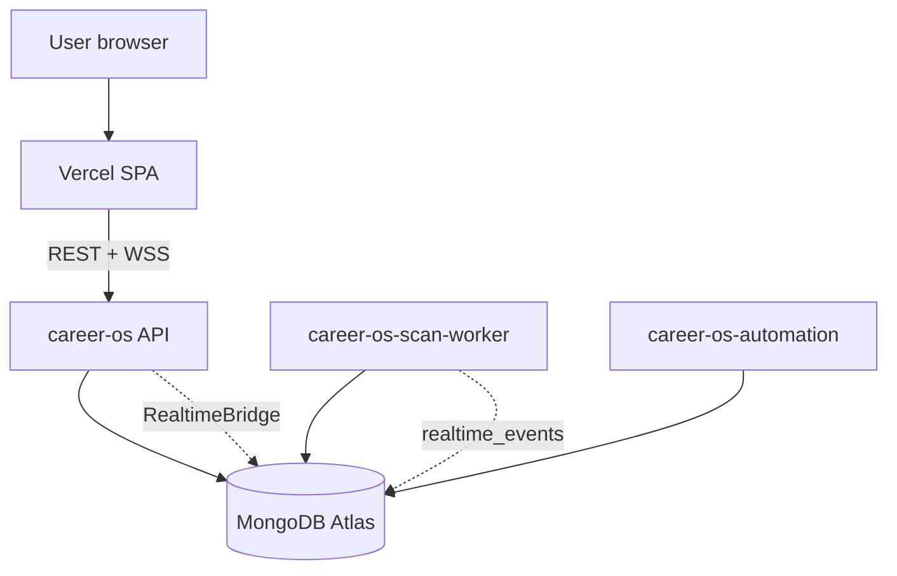

# Career OS

<p align="center">
  
</p>

**By [ELVA Tech](https://elvatech.in)** · Part of **[Career Lens](https://career-lens.in)**

Career OS is an AI-powered job search and career automation platform. It aggregates roles from multiple job boards, scores them against your resume, runs scheduled scans, supports browser-based automation, and provides resume, interview, analytics, and copilot tooling from a single dashboard.

This is a **production-grade modular distributed monolith**: one repository, one MongoDB database, multiple runtime processes on Render — not microservices hype, but intentional separation for reliability on free-tier infrastructure.

---

## Documentation portal

**Start here:** [docs/README.md](docs/README.md)

| Audience | Entry |
|----------|--------|
| New developer | [docs/developer-guide/README.md](docs/developer-guide/README.md) |
| DevOps / deploy | [docs/deployment/render-vercel-deployment.md](docs/deployment/render-vercel-deployment.md) |
| Architecture | [docs/architecture/overview.md](docs/architecture/overview.md) |
| QA / testing | [docs/testing/README.md](docs/testing/README.md) |
| Product / investors | [docs/product/platform-experience.md](docs/product/platform-experience.md) |
| Operations | [docs/operations/README.md](docs/operations/README.md) |
| Env reference | [docs/configuration/environment-variables.md](docs/configuration/environment-variables.md) |
| Phase status | [docs/project-status/current-phase.md](docs/project-status/current-phase.md) |

---

## Vision

Help job seekers treat search like an **operating system**: one workspace for discovery, matching, application tracking, and AI coaching — instead of ten browser tabs and spreadsheets.

---

## Key features

| Area | Capability | Status |
|------|------------|--------|
| Job discovery | LinkedIn, Indeed, Naukri, Instahyre, RemoteOK, Arbeitnow | **Implemented** |
| AI matching | Resume-based match scores | **Implemented** |
| Background scans | Queue + live progress | **Implemented** (distributed) |
| Scheduled scans | Email + in-app notifications | **Implemented** |
| Realtime UI | WebSocket + **polling fallback** | **Implemented** |
| Resume AI | ATS, keywords, variants | **Implemented** |
| Career Copilot & analytics | Gemini-powered insights | **Implemented** |
| Chrome extension | LinkedIn session pairing | **Implemented** |
| Auto-apply | Playwright-assisted flows | **Partial** (board-specific) |
| Celery scale-out | Redis task queue | **Partial** (off in prod) |

---

## Distributed architecture (transparent)



### Why distributed monolith (not microservices)?

| Goal | Approach |
|------|----------|
| API stays fast at login | Heavy scans on **scan-worker** |
| Free-tier Render | Mongo queues, no mandatory Redis |
| One team, one release | Single repo, shared models |
| Scale path exists | More workers, optional Celery later |

We **do not** hide workers or queues — they are documented in [docs/architecture/](docs/architecture/).

### Render services

| Service | Role |
|---------|------|
| **career-os** (API) | REST, auth, WebSocket, enqueue scans, realtime bridge |
| **career-os-scan-worker** | Mongo queue consumer, APScheduler, Playwright scans |
| **career-os-automation** | Automation worker (health + future browser jobs) |

Frontend: **Vercel** (`frontend/`). Database: **MongoDB Atlas**.

---

## Queue & synchronization (Mongo, not Redis)

| Collection | Purpose |
|------------|---------|
| `scan_execution_tasks` | Scan job queue (`queued` → `claimed` → `running` → …) |
| `scan_states` | Progress % for polling (`GET /scans/status/{id}`) |
| `realtime_events` | Cross-service WebSocket bus (workers publish, API bridge delivers) |

**Production default:** `CELERY_ENABLED=false`, `REDIS_ENABLED=false`. Celery/Redis code paths exist for future scale — see [docs/architecture/scaling-strategy.md](docs/architecture/scaling-strategy.md).

### Realtime flow

```
scan-worker → Mongo realtime_events → API RealtimeBridgeLoop → WebSocket → browser
                                      ↘
                    GET /scans/status (polling fallback — required)
```

---

## Infrastructure stack

| Layer | Technology |
|-------|------------|
| Frontend | React 19, Vite, TypeScript, Tailwind, shadcn/ui |
| API | FastAPI, Python 3.12 |
| Database | MongoDB Atlas |
| Cache (optional) | Upstash Redis REST |
| Automation | Playwright (Chromium) |
| Scheduler | APScheduler (on scan-worker in prod) |
| AI / email / files | Gemini, Resend, Cloudinary |
| Deploy | Vercel + Render Docker |

---

## Free-tier optimization

- Mongo-backed scan queue and realtime bus (no always-on Redis)
- TTL indexes on operational collections (7–30 day retention)
- API does not run heavy scans in dispatch mode
- Workers expose health HTTP (Render requires open `PORT`)
- UptimeRobot keep-alive on API `/health`

Details: [docs/architecture/free-tier-strategy.md](docs/architecture/free-tier-strategy.md)

---

## Local development

### Prerequisites

- Node.js 20+, Python 3.12+, Docker (optional Redis for local features)

### Quick monolith (simplest)

```bash
cd backend && cp .env.example .env  # fill MONGO_URI, keys
pip install -r requirements.txt && playwright install chromium
uvicorn app.main:app --reload

cd frontend && npm install && npm run dev
```

### Production-like (API + worker)

```bash
# Terminal 1
cd backend && python start_api.py

# Terminal 2
cd backend && python start_scan_worker.py
```

See [docs/developer-guide/debugging-distributed.md](docs/developer-guide/debugging-distributed.md).

---

## Production deployment

1. Deploy **career-os** API — `python start_api.py` — [render.yaml](render.yaml)
2. Deploy **career-os-scan-worker** — `python start_scan_worker.py`
3. Deploy **career-os-automation** — `python start_automation_worker.py` (manual service if not in blueprint)
4. Deploy **Vercel** with `VITE_API_BASE_URL` / `VITE_WS_BASE_URL`
5. UptimeRobot → `HEAD /health` on API

Full guide: [docs/deployment/render-vercel-deployment.md](docs/deployment/render-vercel-deployment.md)

### Production env (API excerpt)

```env
SERVICE_MODE=api
SCAN_EXECUTION_MODE=dispatch
ENABLE_SCHEDULER=false
ENABLE_REALTIME=true
REALTIME_BRIDGE_ENABLED=true
```

---

## Repository layout

```text
career-os/
├── frontend/          # React SPA
├── backend/           # FastAPI + workers (start_*.py)
├── extension/         # Career Lens Chrome extension
├── docs/              # Full documentation portal
├── infra/             # Docker, nginx, scripts
└── render.yaml
```

---

## Known limitations (honest)

| Limitation | Impact |
|------------|--------|
| Render cold starts | Slow first request after idle |
| Worker poll interval (~8s) | Queue pickup delay |
| Realtime bridge (~1.5s) | WS slightly behind state |
| Single concurrent scan per worker default | Throughput cap |
| Indeed / some boards | Datacenter IPs often **403** — partial results |
| WebSocket | Best-effort; **polling required** for reliability |
| Automation worker | Early stage — most Playwright on scan-worker |
| Atlas M0 512MB | TTL discipline required |

---

## Security

- JWT auth, user-scoped data, secrets in Render env only
- Workers are not public APIs (health endpoints only)
- See [docs/architecture/security-model.md](docs/architecture/security-model.md)

---

## Roadmap

| Phase | Status |
|-------|--------|
| Distributed runtime + Mongo queue | **Done** |
| Mongo scan state + realtime bridge | **Done** |
| TTL / storage protection | **Done** |
| Redis/Celery production queue | **Planned** |
| Full automation worker dequeue | **Planned** |
| Job archival (90d+) | **Planned** |

[docs/project-status/current-phase.md](docs/project-status/current-phase.md) · [docs/roadmap/future-roadmap.md](docs/roadmap/future-roadmap.md)

---

## Tests

```bash
cd backend && REDIS_ENABLED=false pytest tests/
```

---

## License

Private project — add license terms as needed.
