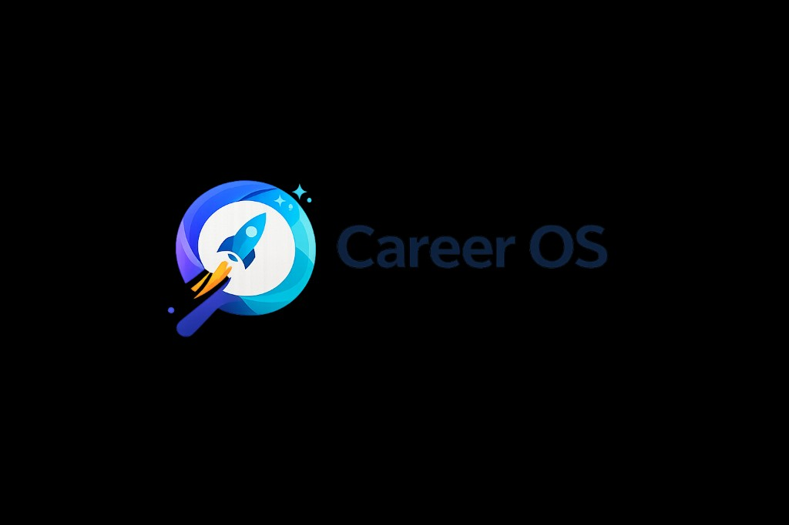

# Career OS — Documentation Portal

<p align="center">
  
</p>

**Organization:** [ELVA Tech](https://elvatech.in)  
**Parent platform:** [Career Lens](https://career-lens.in)  
**Product:** Career OS — AI-powered job discovery and career automation

---

## Quick links

| Audience | Start here |
|----------|------------|
| New engineer | [Developer onboarding](./onboarding/developer-onboarding.md) |
| DevOps / deploy | [Render + Vercel deployment](./deployment/render-vercel-deployment.md) |
| Architecture review | [System overview](./architecture/system-overview.md) |
| API integration | [API reference](./api/api-reference.md) |
| Incidents | [Troubleshooting](./troubleshooting/common-issues.md) |
| Beta / ops | [Beta readiness](./beta/beta-readiness.md) |
| Investors / demos | [Product overview](./product/overview.md) |

---

## Documentation map

### Product

- [Product overview](./product/overview.md)
- [Vision and goals](./product/vision-and-goals.md)
- [Onboarding experience (trust & LinkedIn)](./product/onboarding-experience.md)
- [UI walkthrough](./ui/ui-walkthrough.md)

### Architecture

- [System overview](./architecture/system-overview.md)
- [Scan execution isolation (Phase 1A)](./architecture/scan-execution-isolation.md)
- [Folder structure](./architecture/folder-structure.md)
- [Engineering decisions](./engineering/engineering-decisions.md)

### Frontend

- [Frontend architecture](./frontend/frontend-architecture.md)

### Backend

- [Backend architecture](./backend/backend-architecture.md)
- [API reference](./api/api-reference.md)

### Data

- [MongoDB schema](./database/mongodb-schema.md)

### Automation & scheduling

- [Playwright automation](./automation/playwright-automation.md)
- [LinkedIn session management](./automation/linkedin-session-management.md)
- [Job aggregation pipeline](./automation/job-aggregation-pipeline.md)
- [Resume matching engine](./automation/resume-matching-engine.md)
- [APScheduler](./scheduling/apscheduler.md)

### Browser extension

- [Extension architecture](./extension/extension-architecture.md)
- [Local development](./extension/local-development.md)
- [Chrome Web Store plan](./extension/chrome-web-store-plan.md)

### Features

- [Job discovery](./features/job-discovery.md)
- [Resume AI](./features/resume-ai.md)
- [Interview prep](./features/interview-prep.md)
- [Career analytics](./features/career-analytics.md)
- [Email & notifications](./features/email-notifications.md)

### Beta & legal

- [Beta readiness checklist](./beta/beta-readiness.md)
- Privacy policy (in-app): `/privacy-policy` — `frontend/src/pages/PrivacyPolicyPage.jsx`

### Deployment & operations

- [Render + Vercel deployment](./deployment/render-vercel-deployment.md)
- [Health checks & admin email](./deployment/notifications-and-health.md)
- [Environment variables](./deployment/environment-variables.md)
- [UptimeRobot keep-alive](./deployment/uptime-robot-keepalive.md)
- [Logging](./operations/logging.md)
- [Error handling](./operations/error-handling.md)
- [Production readiness checklist](./production/production-readiness-checklist.md)

### Security & scale

- [Security model](./security/security-model.md)
- [Scaling strategy](./scaling/scaling-strategy.md)

### Roadmap

- [Future roadmap](./roadmap/future-roadmap.md)

### Visual assets

- [Screenshots & diagrams guide](./assets/README.md)

---

## Tech stack (summary)

| Layer | Technology |
|-------|------------|
| Frontend | React 19, Vite 6, TypeScript, Tailwind CSS 4 |
| Backend | FastAPI, Python 3.12, Motor (MongoDB) |
| Database | MongoDB Atlas |
| Automation | Playwright (Chromium, subprocess workers) |
| Scheduler | APScheduler (AsyncIOScheduler) |
| AI | Google Gemini |
| Email | Resend |
| Files | Cloudinary |
| Cache / optional queue | Redis, Celery |
| Deploy | Vercel (frontend), Render (API, Docker) |

---

## Repository layout

```text
career-os/
├── frontend/          # React SPA (Vercel)
├── backend/           # FastAPI API (Render Docker)
├── docs/              # This documentation portal
├── infra/             # nginx, backups, monitoring scripts
├── render.yaml        # Render Blueprint
└── docker-compose.yml # Local Redis / optional stack
```

---

## Live URLs (example production)

| Service | URL |
|---------|-----|
| Frontend | `https://career-os-two-chi.vercel.app` |
| API | `https://career-os-pd9g.onrender.com` |
| Health | `GET/HEAD https://career-os-pd9g.onrender.com/health` |
| API docs | `https://career-os-pd9g.onrender.com/docs` (when enabled) |

---

## Contributing to docs

1. Add screenshots under `docs/assets/screenshots/` (see [assets guide](./assets/README.md)).
2. Update the relevant feature doc when shipping a user-facing change.
3. Keep Mermaid diagrams in sync with code when architecture changes.

*Last updated: May 2026*
