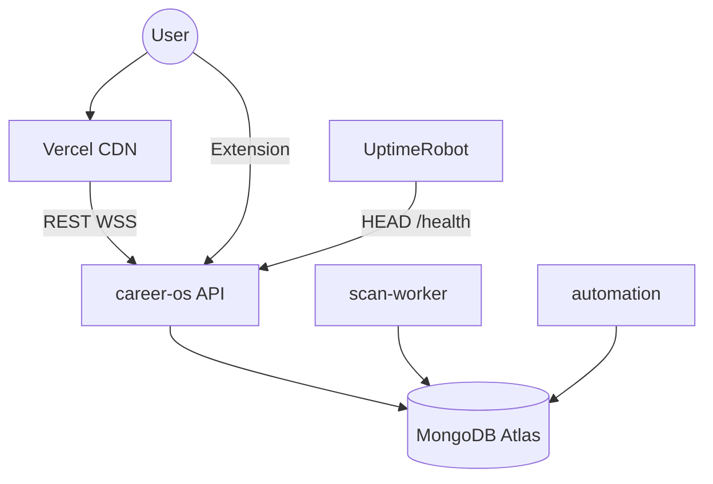

# Deployment topology

Production target: **Vercel (frontend)** + **Render (backend processes)** + **MongoDB Atlas** + optional **Upstash**.

## Render services

| Display name | Blueprint name | Start command | Health |
|--------------|----------------|---------------|--------|
| **career-os** | `career-os-api` | `python start_api.py` | `/health` |
| **career-os-scan-worker** | `career-os-scan-worker` | `python start_scan_worker.py` | `/health` |
| **career-os-automation** | *(manual Web Service)* | `python start_automation_worker.py` | `/health` |

All backend services use the same `backend/Dockerfile` with different `dockerCommand`.

## Environment matrix (production)

| Variable | career-os (API) | scan-worker | automation |
|----------|-----------------|-------------|------------|
| `SERVICE_MODE` | `api` | `scan_worker` | `automation_worker` |
| `SCAN_EXECUTION_MODE` | `dispatch` | `dispatch` | `dispatch` |
| `ENABLE_SCHEDULER` | `false` | `true` | `false` |
| `ENABLE_REALTIME` | `true` | `false` | `false` |
| `REALTIME_BRIDGE_ENABLED` | `true` | — | — |
| `REDIS_ENABLED` | `false` | `false` | `false` |
| `CELERY_ENABLED` | `false` | — | — |

## Startup order

1. **MongoDB Atlas** — reachable from all Render regions used
2. **career-os (API)** — indexes, bridge, public traffic
3. **career-os-scan-worker** — drains queue, runs scheduler
4. **career-os-automation** — optional third service
5. **Vercel frontend** — `VITE_*` pointed at API URL
6. **UptimeRobot** — `HEAD /health` on API every 5 min

Tasks may queue briefly if API deploys before worker — safe.

## Network diagram

## Vercel

| Setting | Value |
|---------|-------|
| Root directory | `frontend` |
| Build | `npm run build` |
| Env | `VITE_API_BASE_URL`, `VITE_WS_BASE_URL` |

Build-time env — redeploy after URL changes.

## Secrets sharing

All Render backend services need the **same** `MONGO_URI`. API additionally needs `JWT_SECRET_KEY`, CORS, and full provider keys. Workers need Gemini/Resend/Cloudinary for scan/email pipelines.

## Free-tier constraints

| Constraint | Mitigation |
|------------|------------|
| Render spin-down | UptimeRobot keep-alive on API |
| Background Workers paid | Workers as Web Services + health port |
| 512MB Atlas | TTL indexes, storage reports |
| No Redis | Mongo queue + Mongo realtime |

See [../deployment/render-multi-service.md](../deployment/render-multi-service.md).
