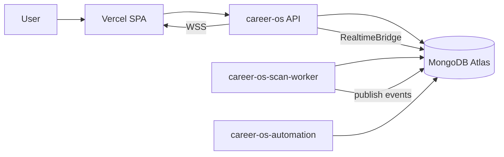
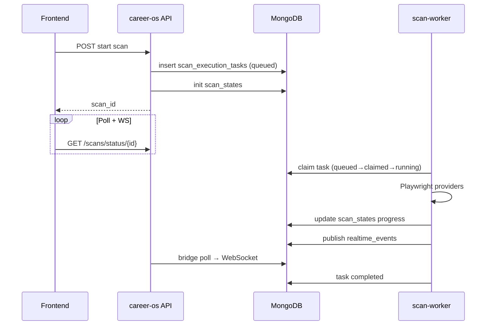
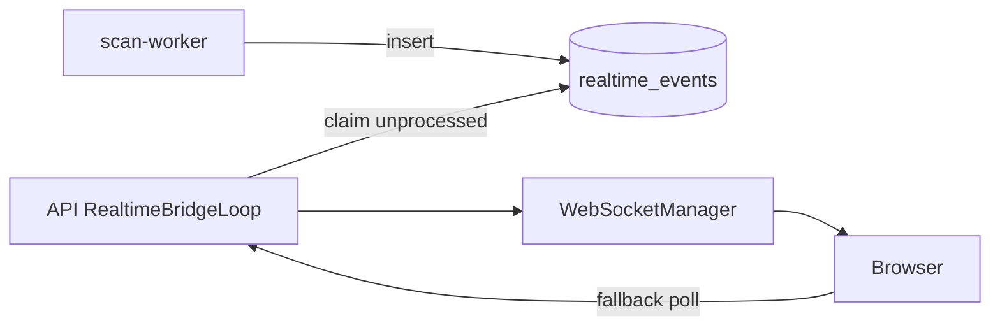
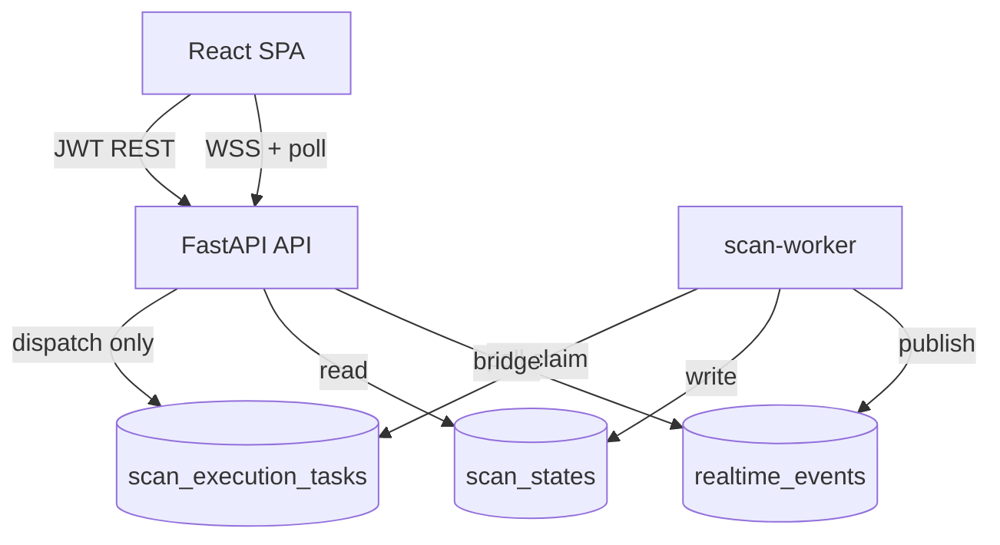

# Architecture diagrams

Central reference for topology and flows. See linked docs for narrative detail.

---

## 1. Overall topology



---

## 2. Scan execution flow



---

## 3. Realtime event flow



---

## 4. Queue lifecycle

```
queued → claimed → running → completed
                          ↘ failed
                          ↘ abandoned (timeout/crash)
```

Mongo collection: `scan_execution_tasks`.

---

## 5. Worker ownership

```text
┌─────────────────────┬──────────────────────────────────────────┐
│ career-os (API)     │ REST, auth, WS, enqueue, bridge, NO scans  │
│ career-os-scan-worker│ queue consumer, scheduler, Playwright scans│
│ career-os-automation │ heartbeat; future browser job dequeue      │
└─────────────────────┴──────────────────────────────────────────┘
```

---

## 6. Mongo synchronization model

| Collection | Writer(s) | Reader(s) | Purpose |
|------------|-----------|-----------|---------|
| `scan_execution_tasks` | API enqueue, worker update | worker | Work queue |
| `scan_states` | worker (primary) | API poll | Progress % |
| `realtime_events` | worker/services | API bridge | WS fan-out |
| `jobs` | worker | API, UI | Results |

Single `MONGO_URI` — shared Atlas database.

---

## 7. Frontend → backend → worker



---

## ASCII: deployment on Render

```text
                    ┌──────────────┐
                    │   Vercel     │
                    │  frontend    │
                    └──────┬───────┘
                           │ HTTPS / WSS
              ┌────────────┼────────────┐
              ▼            ▼            ▼
        ┌──────────┐ ┌─────────────┐ ┌──────────────┐
        │ career-os│ │scan-worker  │ │ automation   │
        │  (API)   │ │             │ │   worker     │
        └────┬─────┘ └──────┬──────┘ └──────┬───────┘
             └──────────────┼───────────────┘
                            ▼
                    ┌───────────────┐
                    │ MongoDB Atlas │
                    └───────────────┘
```
