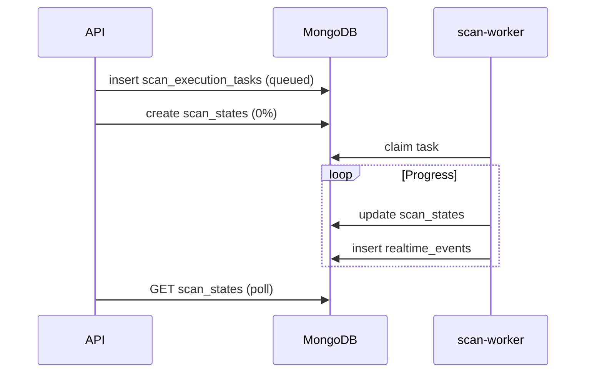

# Mongo queue architecture

Career OS uses **MongoDB collections as queues** for scan work and realtime fan-out. This is intentional for Atlas free tier (512MB) and Render free/starter tiers without managed Redis.

**Status:** **Implemented** for scans and realtime. Celery/Redis queues exist in code but are **not** production-required.

## Collections

| Collection | Role | Producer | Consumer |
|------------|------|----------|----------|
| `scan_execution_tasks` | Scan job queue | API, scheduler (via manager) | Scan worker |
| `scan_states` | Progress source of truth | API (create), worker (update) | API `GET /scans/status` |
| `realtime_events` | WS event bus | Workers | API bridge loop |

## Scan task lifecycle

```
queued → claimed → running → completed | failed | abandoned
```

| Field | Purpose |
|-------|---------|
| `task_id` | Primary id (`stask_...`) |
| `kind` | `manual_preferences`, `background_discover`, `scheduled_automation` |
| `scan_id`, `user_id` | Correlation |
| `created_at` | TTL (14 days) |
| `worker_id` | Claiming worker |
| `error_summary` | Failure reason |

### Claim semantics

- Worker uses `find_one_and_update` on `status: queued` → `claimed` (oldest first).
- Stale `claimed` / `running` tasks are reclaimed per timeout settings.

## Dispatch path (API)

```
Route → ScanExecutionManager → ScanTaskDispatcher
  → insert scan_execution_tasks
  → return immediately (no heavy pipeline in API when dispatch mode)
```

Guards in `app/scan_execution/guards.py` block `run_scan_now` / `execute_background_scan` on API when `SCAN_EXECUTION_MODE=dispatch`.

## Scan state vs task queue

| Concern | Collection | Consumer UX |
|---------|------------|-------------|
| **Work ordering** | `scan_execution_tasks` | N/A (internal) |
| **Progress %** | `scan_states` | Poll + WebSocket |

API polling **always reads Mongo `scan_states` first** — not stale Redis cache for active scans.

## Celery / Redis (partial)

| Variable | Production typical | Purpose |
|----------|-------------------|---------|
| `CELERY_ENABLED` | `false` | Optional async workers |
| `QUEUE_SCANS_ENABLED` | `false` | Route scans to Celery |
| `REDIS_ENABLED` | `false` | Local Redis features |

Code paths remain for future scale-up — see [scaling-strategy.md](./scaling-strategy.md).

## TTL retention (Phase 5)

| Collection | Retention |
|------------|-----------|
| `scan_states` | 7 days (`updated_at`) |
| `scan_execution_tasks` | 14 days (`created_at`) |
| `realtime_events` | 1 day (`created_at`) |

See [../operations/ttl-cleanup.md](../operations/ttl-cleanup.md).

## Diagram


