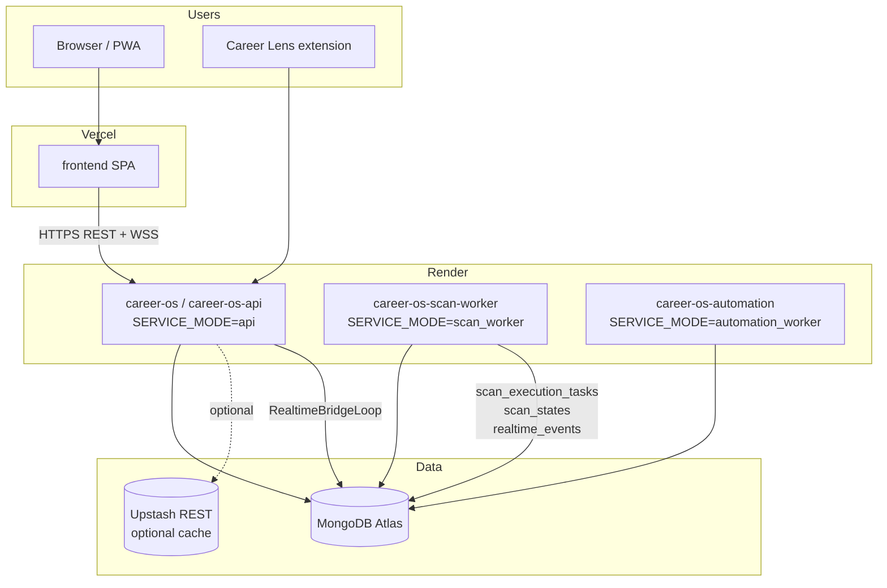

# Architecture overview

Career OS is a **modular distributed monolith**: one repository, one MongoDB database, multiple **runtime processes** on Render. We deliberately did **not** split into microservices repositories or introduce Kafka/RabbitMQ for the current production tier.

## Status legend

| Label | Meaning |
|-------|---------|
| **Implemented** | In production path today |
| **Partial** | Code exists; not always enabled in prod |
| **Planned** | Documented intent; not shipped |

## High-level diagram

## Core principles

1. **One codebase** — shared models, services, and business logic.
2. **Process separation** — API stays lightweight; heavy scans run on scan worker.
3. **Mongo as system of record** — jobs, users, scan state, task queue, realtime bus.
4. **Free-tier realism** — no mandatory Redis/Celery in production; polling fallbacks; TTL cleanup.
5. **Transparency** — architecture is documented, not hidden behind “simple” marketing.

## Major subsystems

| Subsystem | Location | Status |
|-----------|----------|--------|
| HTTP API + WebSocket | `career-os` (API service) | **Implemented** |
| Scan execution queue | Mongo `scan_execution_tasks` | **Implemented** |
| Scan progress state | Mongo `scan_states` | **Implemented** |
| Cross-service realtime | Mongo `realtime_events` + API bridge | **Implemented** |
| APScheduler (scheduled scans) | scan worker (prod) | **Implemented** |
| Celery task queue | `backend/app/queues/` | **Partial** (off in prod) |
| Redis pub/sub realtime | `redis_bridge.py` | **Partial** (off when `REDIS_ENABLED=false`) |
| Playwright automation | scan worker + automation worker + API prep routes | **Implemented** |
| Chrome extension | `extension/` | **Implemented** |

## Documentation map

| Topic | Document |
|-------|----------|
| Distributed runtime | [distributed-runtime.md](./distributed-runtime.md) |
| Scan worker | [scan-worker.md](./scan-worker.md) |
| Automation worker | [automation-worker.md](./automation-worker.md) |
| Mongo queues | [mongo-queue.md](./mongo-queue.md) |
| Realtime sync | [realtime-sync.md](./realtime-sync.md) |
| Deployment | [deployment-topology.md](./deployment-topology.md) |
| Scaling | [scaling-strategy.md](./scaling-strategy.md) |
| Diagrams | [diagrams.md](./diagrams.md) |
| Free tier | [free-tier-strategy.md](./free-tier-strategy.md) |
| Memory | [memory-management.md](./memory-management.md) |
| Security | [security-model.md](./security-model.md) |
| Boundaries | [service-boundaries.md](./service-boundaries.md) |
| Scan isolation (Phases 1A–1B) | [scan-execution-isolation.md](./scan-execution-isolation.md) |

## What we are not (today)

- Not multi-repo microservices.
- Not Kubernetes-first.
- Not Redis-required for scans or realtime in production.
- Not guaranteed anti-bot immunity on all job boards (Indeed and others may 403).

See [../project-status/current-phase.md](../project-status/current-phase.md) for phase history and roadmap.
