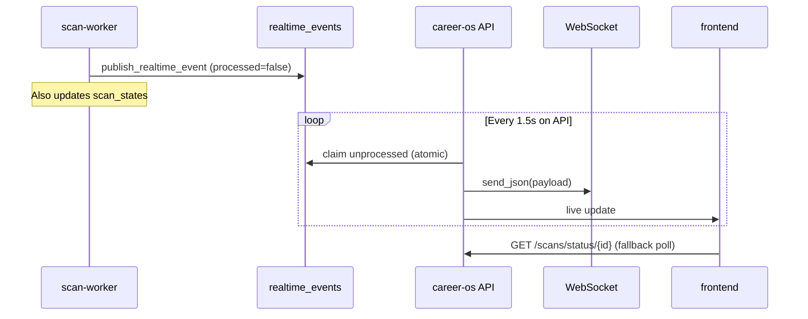

# Realtime synchronization (cross-service)

WebSocket connections terminate on the **API process only**. Scan and automation workers run elsewhere on Render, so in-process `publish_user_event` cannot reach browsers directly.

**Solution (Phase 6):** MongoDB `realtime_events` as a lightweight event bus + **RealtimeBridgeLoop** on API.

**Status:** **Implemented**

## Flow



## Event document schema

```json
{
  "event_type": "scan_progress",
  "user_id": "...",
  "workspace_id": "",
  "scan_id": "...",
  "payload": { "event": "scan_progress", "progress": 42, ... },
  "created_at": "<BSON Date>",
  "processed": false,
  "processed_at": null
}
```

## Duplicate protection

`claim_unprocessed_events()` uses `find_one_and_update` to set `processed: true` **before** WebSocket delivery — each event is claimed once per API instance.

> **Note:** Multiple API replicas would each run a bridge; claim atomicity prevents duplicate delivery per event document.

## Who publishes to Mongo?

| Process | Publishes to `realtime_events`? |
|---------|-------------------------------|
| API | **No** (delivers WS locally) |
| scan-worker | **Yes** |
| automation-worker | **Yes** |

Controlled by `runtime.should_publish_realtime_to_mongo()`.

## Event types (examples)

| `event_type` | When |
|--------------|------|
| `scan_progress` | Provider / phase updates |
| `scan_started` | Scan begins |
| `scan_completed` | Success |
| `scan_failed` | Error |
| `provider_started` / `provider_completed` | Per board |
| `automation_started` / `automation_finished` | Automation runs |
| `notification_created` | In-app notification |

## API configuration

```env
ENABLE_REALTIME=true
REALTIME_BRIDGE_ENABLED=true
REALTIME_BRIDGE_POLL_SECONDS=1.5
REALTIME_BRIDGE_BATCH_SIZE=32
```

## Redis bridge (partial)

If `REDIS_ENABLED=true`, `redis_bridge.py` can pub/sub between processes. **Production Render deploys typically disable Redis.** Mongo bridge is the supported cross-service path on free tier.

## Polling fallback (required)

Frontend **must** keep HTTP polling (`GET /scans/status/{scan_id}`) because:

- WebSocket may disconnect on mobile / sleep
- Bridge adds ~1–2s latency
- Cold start may miss events before WS connects

**Status:** Polling **implemented** and required; WebSocket is enhancement.

## Logs

| Log | Process |
|-----|---------|
| `[REALTIME_EVENT] published` | worker |
| `[REALTIME_BRIDGE] started` | API |
| `[REALTIME_EVENT] delivered` | API |
| `[SCAN_STATE_API]` | API poll |

See [../testing/realtime-verification.md](../testing/realtime-verification.md).
