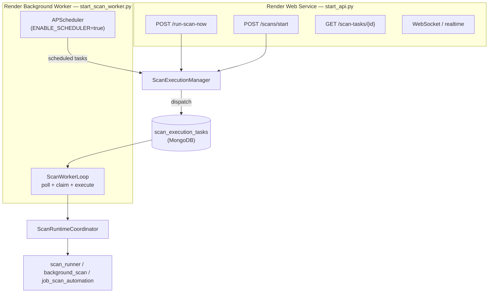

# Scan execution isolation — Phase 1B deployment separation

Real runtime separation: API enqueues scan tasks; a dedicated **scan worker** process executes them. One repo, one codebase, one MongoDB — no Celery/Redis queues yet.

## Runtime topology (production)



## Startup modes

| Entrypoint | SERVICE_MODE | SCAN_EXECUTION_MODE | ENABLE_SCHEDULER | HTTP | Scan execution |
|------------|--------------|---------------------|------------------|------|----------------|
| `uvicorn app.main:app` (legacy) | `api` | `inline` (default) | `true` (default) | yes | inline in API |
| `python start_api.py` | `api` | `dispatch` (default) | `false` (default) | yes | enqueue only |
| `python start_scan_worker.py` | `scan_worker` | `dispatch` (default) | `true` (default) | no | poll + execute |
| `python start_automation_worker.py` | `automation_worker` | `dispatch` | `false` | no | automation only |

## Orchestration layers

| Layer | Module | Role |
|-------|--------|------|
| **ScanExecutionManager** | `app/scan_execution/manager.py` | Facade for routes + scheduler |
| **ScanTaskDispatcher** | `app/scan_execution/dispatcher.py` | Creates tasks; inline vs queue |
| **ScanRuntimeCoordinator** | `app/scan_execution/coordinator.py` | Executes tasks (worker/inline only) |
| **ScanWorkerLoop** | `app/scan_execution/worker_loop.py` | Poll, claim, concurrency, heartbeat |
| **Task store** | `app/scan_execution/task_store.py` | MongoDB `scan_execution_tasks` |
| **Guards** | `app/scan_execution/guards.py` | Block API from running pipelines in dispatch mode |
| **RuntimeManager** | `app/runtime/service_mode.py` | Mode-aware subsystem flags |

## Scan task lifecycle

```
queued → claimed → running → completed | failed | abandoned
```

| Field | Purpose |
|-------|---------|
| `created_at` | Enqueue time (API) |
| `claimed_at` | Worker atomic claim |
| `started_at` | Pipeline start |
| `completed_at` | Terminal state |
| `worker_id` | Claiming worker |
| `dispatch_latency_ms` | `claimed_at − created_at` |
| `error_summary` | Short failure reason |

### Task kinds

| Kind | Source | Executes |
|------|--------|----------|
| `manual_preferences` | `POST /run-scan-now` | `run_scan_now` |
| `background_discover` | `POST /scans/start` | `execute_background_scan` |
| `scheduled_automation` | APScheduler | `run_daily_job_scan_automation` |

## Scheduler ownership

| Config | Scheduler runs? | Catch-up scans? |
|--------|-----------------|-----------------|
| API + `ENABLE_SCHEDULER=false` | Never | Never |
| API + `inline` + `ENABLE_SCHEDULER=true` | API process (local dev) | Yes if `SCHEDULER_STARTUP_CATCHUP=true` |
| scan_worker + `ENABLE_SCHEDULER=true` | Worker process | Disabled by default in `start_scan_worker.py` |

Only one scheduler instance should run in production: **scan worker**.

## Worker safety controls

| Setting | Default | Purpose |
|---------|---------|---------|
| `SCAN_WORKER_MAX_CONCURRENT` | `1` | Semaphore limit |
| `SCAN_WORKER_POLL_SECONDS` | `8` | Idle poll interval |
| `SCAN_WORKER_HEARTBEAT_SECONDS` | `60` | Queue snapshot logs |
| `SCAN_TASK_CLAIM_TIMEOUT_SECONDS` | `300` | Requeue stale `claimed` tasks |
| `SCAN_TASK_EXECUTION_TIMEOUT_SECONDS` | `7200` | Abandon stale `running` tasks |

## Environment variables

| Variable | Default | Purpose |
|----------|---------|---------|
| `SERVICE_MODE` | `api` | `api` \| `scan_worker` \| `automation_worker` |
| `SCAN_EXECUTION_MODE` | `inline` | `inline` (monolith) \| `dispatch` (worker queue) |
| `ENABLE_SCHEDULER` | `true` | APScheduler |
| `ENABLE_REALTIME` | `true` | WebSocket subscriber (API only) |

## Render deployment

See [Render + Vercel deployment](../deployment/render-vercel-deployment.md#4-scan-worker-background-service-phase-1b).

### API service

```bash
python start_api.py
```

```env
SERVICE_MODE=api
SCAN_EXECUTION_MODE=dispatch
ENABLE_SCHEDULER=false
ENABLE_REALTIME=true
```

### Scan worker service

```bash
python start_scan_worker.py
```

```env
SERVICE_MODE=scan_worker
SCAN_EXECUTION_MODE=dispatch
ENABLE_SCHEDULER=true
ENABLE_REALTIME=false
SCHEDULER_STARTUP_CATCHUP=false
```

**Deploy order:** MongoDB ready → API → scan worker (worker can start first; tasks queue until worker is up).

**Verify API logs:** `Scheduler not started owner=none`, `scan_execution_mode=dispatch`.

**Verify worker logs:** `Scheduler owner=scan_worker`, `[SCAN_WORKER] loop started`, `[SCAN_TASK] claimed`.

## API endpoints (unchanged contracts)

- `POST /run-scan-now` — returns `status=queued` + `task_id` in dispatch mode
- `POST /scans/start` — returns `scan_id` immediately; poll `GET /scans/status/{scan_id}`
- `GET /scan-tasks/{task_id}` — dispatch task lifecycle (new, lightweight)

## Backward compatibility

- **`SCAN_EXECUTION_MODE=inline`** — full monolith; scans run in API process
- **`uvicorn app.main:app`** — unchanged unless env vars set

## Remaining bottlenecks / next phase

- Playwright automation still shares codebase (optional `automation_worker`)
- Mongo poll queue (Phase 2: Redis + Celery)
- API can still OOM from Playwright session prep, large uploads, or concurrent non-scan workloads
- Email digest and scoring run on worker — worker memory is the scan bottleneck now

## Unlocked future phases

- **Phase 2** — Redis queue + Celery; same task model and route contracts
- **Phase 3** — Dedicated automation worker for Playwright isolation
