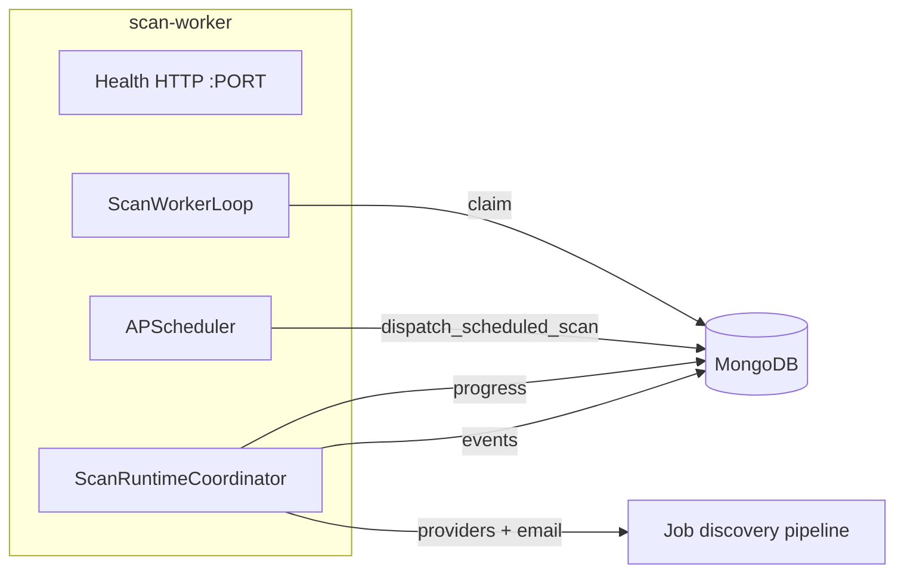

# Scan worker

**Service:** `career-os-scan-worker` on Render  
**Entrypoint:** `python start_scan_worker.py`  
**Status:** **Implemented** (production path for all heavy scans)

## Responsibilities

| Owns | Does not own |
|------|----------------|
| `ScanWorkerLoop` — poll/claim Mongo tasks | Public HTTP API (except health) |
| APScheduler — scheduled user scans | WebSocket server |
| `execute_background_scan`, `run_scan_now`, scheduled automation scans | User auth sessions |
| Playwright job discovery (in scan pipelines) | Frontend static assets |
| Writing `scan_states` progress to Mongo | |
| Publishing `realtime_events` for WS bridge | |

## Process architecture



## Health HTTP server

Render free tier requires an open **PORT**. The worker exposes:

- `GET /` → plain text alive
- `GET /health` → `{"status":"ok","service":"scan_worker"}`

This is **not** a public API — health checks only.

## Worker loop safety

| Setting | Default | Purpose |
|---------|---------|---------|
| `SCAN_WORKER_POLL_SECONDS` | 8 | Idle poll interval |
| `SCAN_WORKER_MAX_CONCURRENT` | 1 | Semaphore limit |
| `SCAN_TASK_CLAIM_TIMEOUT_SECONDS` | 300 | Reclaim stale claims |
| `SCAN_TASK_EXECUTION_TIMEOUT_SECONDS` | 7200 | Abandon stuck runs |

## Task kinds executed

| Kind | Trigger | Pipeline |
|------|---------|----------|
| `background_discover` | `POST /scans/start` | `execute_background_scan` |
| `manual_preferences` | `POST /run-scan-now` | `run_scan_now` |
| `scheduled_automation` | APScheduler cron | `run_daily_job_scan_automation` |

## Logs to watch

```
[SCAN_WORKER] loop started
[SCAN_TASK] claimed / started / completed
[SCAN_PROGRESS_WRITE] scan_id=... progress=...
[REALTIME_EVENT] published type=scan_progress
[SCHEDULER] APScheduler started
```

## Production env (minimum)

```env
SERVICE_MODE=scan_worker
SCAN_EXECUTION_MODE=dispatch
ENABLE_SCHEDULER=true
ENABLE_REALTIME=false
MONGO_URI=...
GEMINI_API_KEY=...
RESEND_*=...
PLAYWRIGHT_HEADLESS=true
```

Same `MONGO_URI` as API — **required** for queue, scan state, and realtime events.

## Failure modes

| Symptom | Likely cause |
|---------|----------------|
| Scans stuck queued | Worker down or wrong `MONGO_URI` |
| 0% progress forever | `scan_states` not updating — check worker logs |
| OOM on worker | Playwright + concurrent scans — keep `MAX_CONCURRENT=1` |
| Duplicate scheduled scans | Multiple schedulers — ensure API `ENABLE_SCHEDULER=false` |

See [../operations/worker-lifecycle.md](../operations/worker-lifecycle.md).
