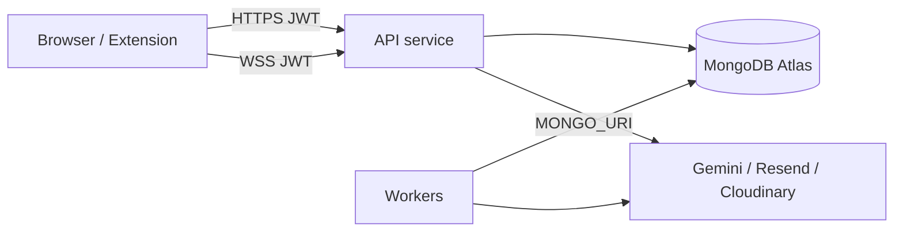

# Security model

High-level security architecture for Career OS. See also [../security/security-model.md](../security/security-model.md) for auth details.

## Trust boundaries

## Authentication

| Mechanism | Status |
|-----------|--------|
| JWT access + refresh | **Implemented** |
| Password reset OTP | **Implemented** |
| Google OAuth | **Partial** (extension point in code) |
| Extension pairing tokens | **Implemented** |

## Authorization

- User-scoped data via `user_id` on Mongo documents
- `get_scan_state(..., user_id=)` isolation
- Route dependencies `get_current_user` on protected APIs

## Secrets handling

| Secret | Storage |
|--------|---------|
| `JWT_SECRET_KEY` | Render env only |
| `MONGO_URI` | Render env only |
| Provider API keys | Render env only |
| `VITE_*` | Public URLs only on Vercel |

Never commit `backend/.env` or production env files.

## Browser sessions

LinkedIn and other boards store Playwright `storage_state` in Mongo `browser_sessions` (encrypted in transit to Atlas; at-rest security depends on Atlas config).

## Worker surfaces

Workers expose **health HTTP only** — no public job API. Do not route public traffic to scan-worker URLs except health checks.

## WebSocket

- Authenticated connection (see `realtime_router`)
- Connection limits: `WEBSOCKET_MAX_CONNECTIONS_PER_USER`, `WEBSOCKET_MAX_CONNECTIONS_TOTAL`

## Compliance-oriented notes

- Privacy policy in-app at `/privacy-policy`
- User data deletion — **partial** (manual ops / planned automation)
- SOC2 — **not claimed**; early-stage SaaS

## Threat considerations

| Threat | Mitigation |
|--------|------------|
| JWT theft | HTTPS, short access TTL, refresh rotation |
| Scan task injection | Tasks created via authenticated API routes |
| Mongo URI leak | Rotate URI; IP allowlist on Atlas |
| SSRF from providers | Allowlisted fetchers only |
