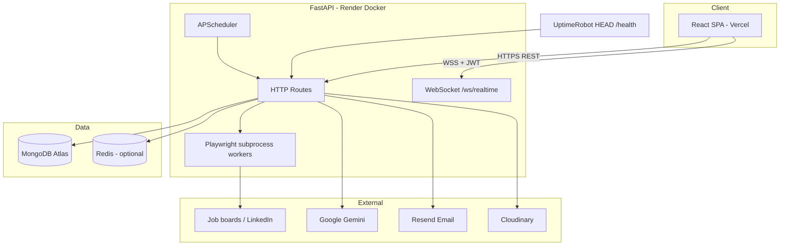
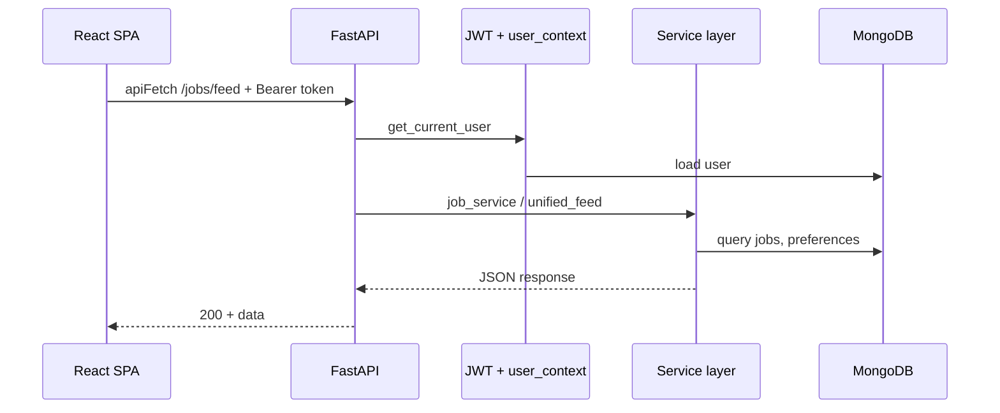
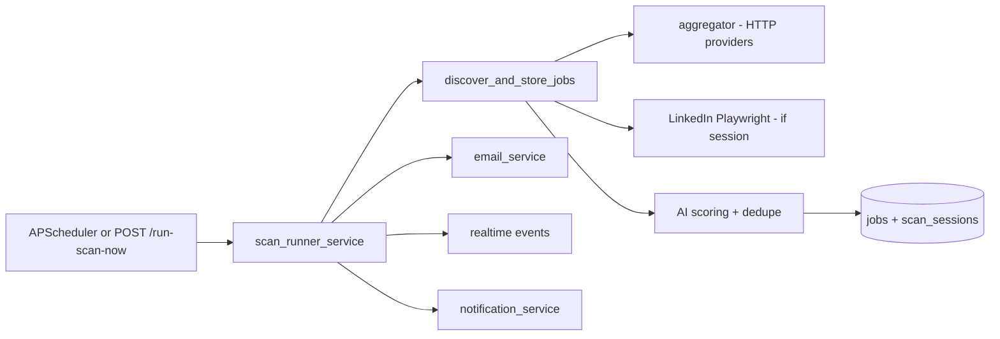
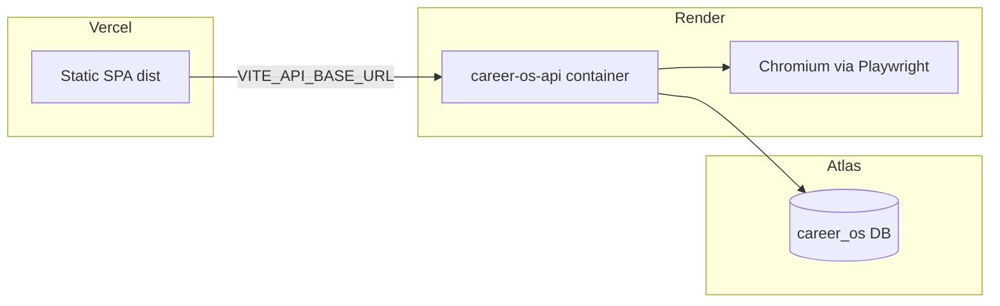

# System overview

> **Updated architecture:** This page is legacy. Use **[overview.md](./overview.md)** and **[diagrams.md](./diagrams.md)** for the current distributed runtime (API + scan-worker + automation, Mongo queues).

## High-level architecture

## Request lifecycle (authenticated API)

## Scan pipeline (scheduled or manual)

## Deployment topology

## Component responsibilities

| Component | Responsibility |
|-----------|----------------|
| **Frontend** | UX, auth tokens in localStorage, wake `/health`, WebSocket client |
| **FastAPI** | REST + WS, business logic orchestration, scheduler host |
| **MongoDB** | Users, preferences, jobs, applications, notifications, runs |
| **Playwright workers** | LinkedIn discovery, session prep, assisted apply (subprocess) |
| **APScheduler** | Per-user scan crons, reminders, heartbeat |
| **Gemini** | Resume AI, copilot, interview, insights |
| **Resend** | Transactional email / digests |

## Health and observability

| Endpoint | Purpose |
|----------|---------|
| `HEAD /` | Render port probe → 200 |
| `HEAD /health` | UptimeRobot free tier keep-alive |
| `GET /health` | JSON `{ status, service, scheduler }` |
| `GET /system/status` | Mongo, Redis, Celery, WS count |
| `GET /logs` | In-memory log viewer (HTML) |

## Cross-cutting concerns

- **CORS:** `FRONTEND_URL` + `CORS_ORIGINS` + optional `CORS_ORIGIN_REGEX` for `*.vercel.app`
- **Rate limiting:** Redis middleware (can disable via `RATE_LIMIT_ENABLED`)
- **Circuit breakers:** Per job provider in aggregator
- **Structured logging:** JSON lines + user email from context

## Related docs

- [Folder structure](./folder-structure.md)
- [Backend architecture](../backend/backend-architecture.md)
- [Frontend architecture](../frontend/frontend-architecture.md)
- [Deployment](../deployment/render-vercel-deployment.md)
