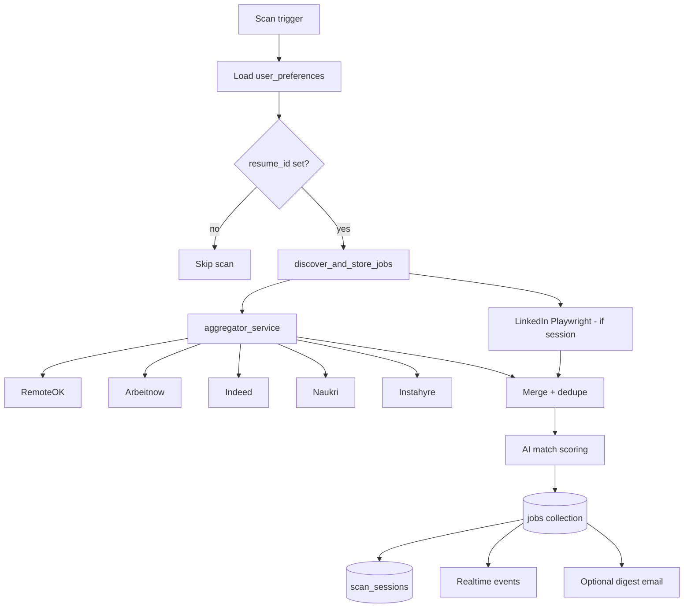

# Job aggregation pipeline

## End-to-end flow

## Providers

| Provider | Type | Module |
|----------|------|--------|
| RemoteOK | HTTP API | `remoteok_source.py` |
| Arbeitnow | HTTP API | `arbeitnow_source.py` |
| Indeed | HTTP/scrape | `indeed_source.py` |
| Naukri | HTTP/scrape | `naukri_source.py` |
| Instahyre | HTTP | `instahyre_source.py` |
| LinkedIn | Playwright | `linkedin_playwright_source.py` |

**Aggregator:** `app/services/job_sources/aggregator_service.py`

- `asyncio.gather` parallel fetches
- Per-provider **circuit breaker** (`app/core/circuit_breaker.py`)
- Diagnostics in scan summary (`failed_sources`, counts)

## Trigger points

| Trigger | Entry |
|---------|-------|
| Manual | `POST /run-scan-now` → `scan_runner_service.run_scan_now` |
| Scheduled | APScheduler → `job_scan_automation_service` |
| Startup catch-up | `run_overdue_scheduled_scans()` |
| Cron | `POST /internal/cron/scheduled-scans` + secret |

## Filtering (post-fetch)

Applied in automation and feed:

- `min_match_threshold`
- `remote_only`
- `preferred_locations`
- India/remote eligibility for email alerts (`actionable_in_india`, `remote_priority`)

## Dedupe

`job_dedupe_service.py` — dedupe against **applied** jobs and cross-provider URL/title matching.

## Realtime events during scan

| Event | When |
|-------|------|
| `scan_started` | Scan begins |
| `provider_started` / `provider_status` | Per provider |
| `jobs_fetched` | Batch stored |
| `ai_scoring_complete` | Scoring done |
| `scan_completed` / `scan_failed` | End state |
| `email_delivered` | Digest sent |

## Scan session record

`scan_session_service.py` persists:

- Provider stats
- Job counts
- Timestamps
- Link to `scan_id` for analytics UI

## Related

- [Resume matching](./resume-matching-engine.md)
- [Job discovery feature](../features/job-discovery.md)
- [APScheduler](../scheduling/apscheduler.md)
