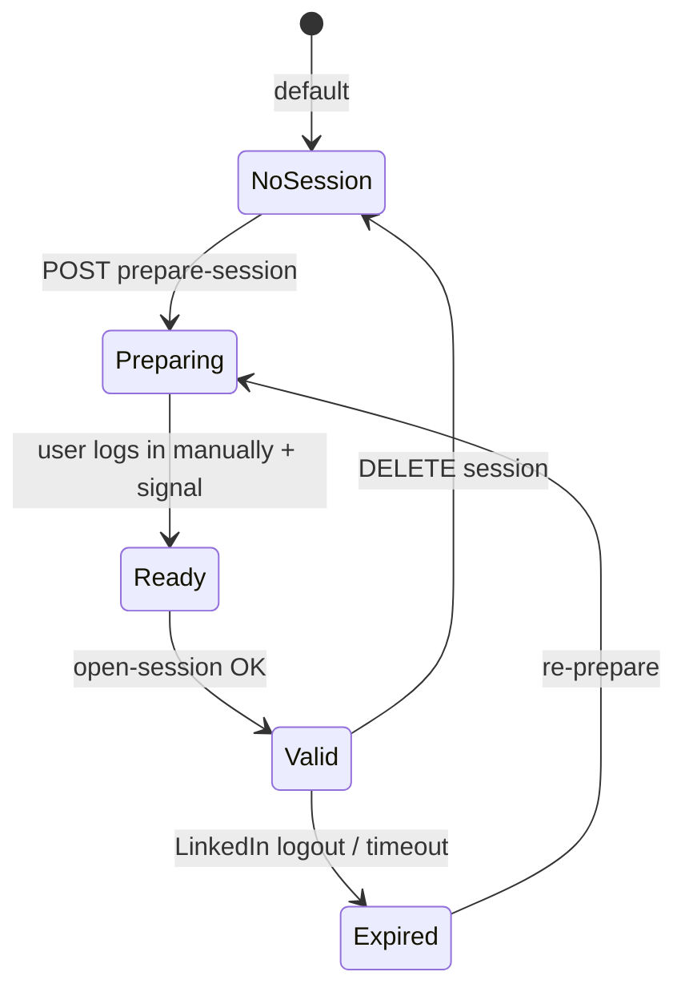

# LinkedIn session management

## Overview

LinkedIn job discovery uses **saved browser storage state** (cookies/local storage) from a user-prepared Playwright session. Without a valid session, LinkedIn provider returns empty or skipped.

## Lifecycle



## User flow (Automation UI)

1. Open **Operations hub → Automation**
2. Click **Prepare session** — backend starts worker, may open visible browser locally (headless in prod)
3. User completes LinkedIn login in browser window
4. UI signals **done** via prepare signals API
5. Storage state saved under `app/automation/profiles/sessions/`
6. **Session status** shows ready; scans can merge LinkedIn jobs


*Browser session management and LinkedIn state.*

## Backend flow

1. `automation_service.prepare_session()` → worker `prepare-session`
2. `session_manager` writes JSON storage state + metadata
3. During scan: `LinkedInPlaywrightJobSource` loads state
4. `job_service.fetch_and_merge_linkedin_jobs()` merges into batch

## Storage layout

```text
backend/app/automation/profiles/
├── sessions/           # storage_state.json per user/workspace
├── apply_flags/
└── session_metadata.example.json
```

**Production:** files live in container filesystem — **lost on redeploy** unless Render persistent disk mounted.

## Security notes

- Session files equal account access — treat as secrets
- Never commit `profiles/sessions/*` to git (`.gitkeep` only)
- API routes require authentication
- Screenshots path validated against traversal

## Troubleshooting

| Issue | Fix |
|-------|-----|
| LinkedIn always empty | Re-prepare session; check headless detection |
| Session lost after deploy | Add persistent disk or re-login |
| 403 / challenge | Complete verification in prepare browser |
| Scan works but no LI jobs | `enabled_providers` must include linkedin |

## Related

- [Playwright automation](./playwright-automation.md)
- [Job discovery feature](../features/job-discovery.md)
