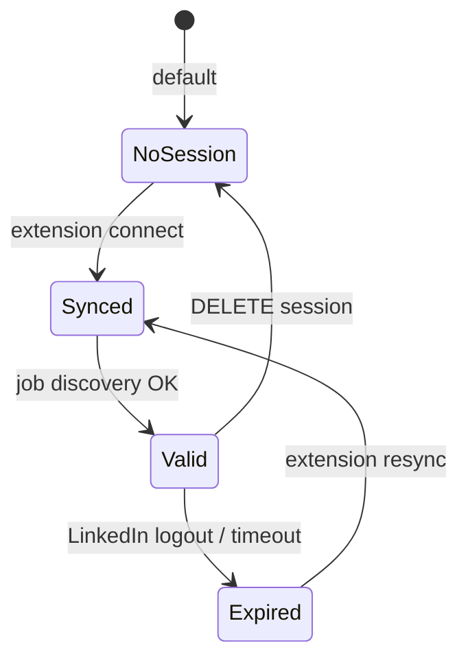

# LinkedIn session management

## Overview

LinkedIn job discovery uses per-user authenticated session state stored in MongoDB (`browser_sessions`).  
Career Lens now syncs this session through the **Career Lens Chrome Extension + Cloud Backend** flow.

## Official production flow

1. User logs into Career OS web app
2. User opens Scans & Automation and generates a 6-digit pairing code
3. User installs/opens Career Lens extension and enters pairing code
4. Extension syncs LinkedIn cookies to `POST /automation/linkedin/connect-with-code`
5. Backend validates code (`linkedin_pairing_sessions`), resolves `user_id`, stores session in `browser_sessions`
6. Cloud Playwright discovery reuses that session

## End-user guide (non-technical)

Use this script in product copy, onboarding, or support replies when LinkedIn is not connected.

### Desktop (first-time setup)

1. Open Career OS in Chrome and sign in.
2. Go to **Scans & Automation**.
3. Click **Generate Pairing Code** (code works once for 5 minutes).
4. Install/open **Career Lens** extension.
5. Make sure LinkedIn is already logged in in the same Chrome profile.
6. Enter the 6-digit code in Career Lens and click **Connect**.
7. Return to Scans & Automation and confirm status changes to:
   - **Connection: Connected**
   - **Session health: Healthy**

### Mobile users (when no active session)

LinkedIn setup cannot be completed inside mobile browsers. Show this guidance:

- "Finish this once on a desktop/laptop Chrome browser with Career Lens."
- "After desktop connection is done, LinkedIn automation works from mobile too."
- "If status still shows not connected, refresh the Scans & Automation page."

## Local development

Local developers can still use headed prepare in Automation UI for debugging browser behavior.  
Production session onboarding is extension-first.

## Lifecycle

## API endpoints

| Method | Path | Purpose |
|--------|------|---------|
| POST | `/automation/linkedin/pairing-code` | Create one-time 6-digit pairing code (auth) |
| POST | `/automation/linkedin/connect-with-code` | Extension sync via pairing code (no JWT in extension) |
| GET | `/automation/linkedin/status` | Connection health, last fetch, `sessionHealthy`, `providerStatus` |
| POST | `/automation/linkedin/disconnect` | Remove LinkedIn session + invalidate pairing |
| POST | `/automation/linkedin/resync` | Extension silent resync (sync token, no JWT) |
| GET | `/automation/session-status` | Session metadata for current user |
| DELETE | `/automation/session/{platform}` | Remove stored session |
| POST | `/automation/test-session/{platform}` | Local headed prepare (dev/debug) |

## Security notes

- Session material is treated as sensitive authentication state
- Extension never stores LinkedIn passwords
- Cookie values are never surfaced in API responses/UI
- Pairing code expires in 5 minutes and can be used once
- Career OS JWT is never copied into the extension

## Related

- [Playwright automation](./playwright-automation.md)
- [Extension architecture](../extension/extension-architecture.md)
- [Job discovery feature](../features/job-discovery.md)
