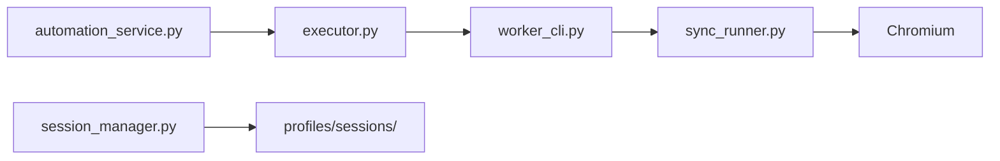

# Playwright automation architecture

## Design principle

**Playwright never runs inside the FastAPI event loop.**  
All browser work runs in **subprocess workers** to avoid blocking asyncio and to isolate Chromium crashes.

## Architecture

## Key files

| Path | Role |
|------|------|
| `app/services/automation_service.py` | HTTP-facing facade |
| `app/automation/browser/executor.py` | Spawn subprocess, timeouts, stderr |
| `app/automation/browser/worker_cli.py` | CLI: `python -m app.automation.browser.worker_cli <cmd> <json>` |
| `app/automation/browser/sync_runner.py` | Sync Playwright: launch, navigate, scrape |
| `app/automation/browser/browser_manager.py` | Async wrapper |
| `app/automation/browser/session_manager.py` | Load/save `storage_state` JSON |
| `app/automation/browser/prepare_signals.py` | UI “session ready” signals |
| `app/services/browser_session_store.py` | Per-user MongoDB session store |
| `app/automation/profiles/` | Session storage (gitignored except examples) |

## Commands (worker CLI)

Examples (see `sync_runner.py` for full list):

- `health` — Chromium launch smoke test
- `prepare-session` — Manual login flow, save storage state
- `open-session` — Validate saved session
- `linkedin-discovery` — Job search scrape
- `linkedin-easy-apply` — Assisted apply (long timeout)

## Configuration (`config.py`)

| Variable | Default | Purpose |
|----------|---------|---------|
| `PLAYWRIGHT_HEADLESS` | `true` | Headless in production |
| `PLAYWRIGHT_VIEWPORT_WIDTH/HEIGHT` | 1280×720 | Viewport |
| `PLAYWRIGHT_DEFAULT_TIMEOUT_MS` | 30000 | Navigation timeout |
| `PLAYWRIGHT_USER_AGENT` | optional | Custom UA |
| `AUTOMATION_WORKER_MODE` | `subprocess` | Documented mode |

## HTTP API (`/automation/*`)

| Endpoint | Purpose |
|----------|---------|
| `GET /automation/browser-health` | Worker health |
| `GET /automation/session-status` | Saved session metadata |
| `POST /automation/prepare-session` | Start manual prep |
| `POST /automation/open-session` | Test session |
| `DELETE /automation/session` | Clear session |
| `GET /automation/screenshot/{path}` | Debug screenshots (path-safe) |

## Production (Render)

- Chromium installed in Docker: `playwright install --with-deps chromium`
- Session source of truth is MongoDB `browser_sessions`; filesystem cache is best-effort fallback
- First build may take **10+ minutes** due to browser deps

## Extension session bridge

Career Lens Chrome extension is the production session bridge:

- Extension reads LinkedIn authenticated cookies from Chrome
- Calls `POST /automation/linkedin/connect-with-code` using one-time 6-digit pairing code
- Backend normalizes cookies into Playwright-compatible `storage_state`
- Discovery worker loads per-user session from MongoDB

## Failure modes

| Symptom | Cause | Mitigation |
|---------|-------|------------|
| Worker timeout | Slow LinkedIn / CAPTCHA | Increase timeout; manual session prep |
| Subprocess stderr | Chromium crash | Check `/logs`; restart service |
| Empty discovery | Expired session | Re-run prepare-session from Automation UI |
| High memory | Multiple Chromium | `WEB_CONCURRENCY=1` on Render |

## Related

- [LinkedIn session management](./linkedin-session-management.md)
- [Job aggregation pipeline](./job-aggregation-pipeline.md)
- [Troubleshooting](../troubleshooting/common-issues.md)
