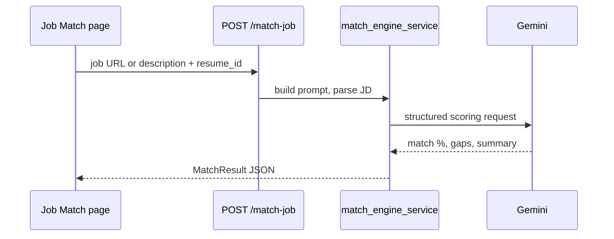

# Resume matching engine

## Overview

Career OS scores jobs against the user's parsed resume using a combination of **rule-based signals** and **Gemini AI** analysis.

## Components

| Module | Role |
|--------|------|
| `resume_service.py` | Store parsed resume (skills, experience, Cloudinary file) |
| `resume_scan_profile_service.py` | Extract targets from resume → sync preferences |
| `match_engine_service.py` | Single job match (`POST /match-job`) |
| `job_match_scoring_service.py` | Batch scoring during scan |
| `job_service.py` | Applies scores to stored jobs |

## Single job match flow



## Batch scoring (scan)

During `discover_and_store_jobs`:

1. Load resume document by `preferences.resume_id`
2. For each candidate job, compute `match_percentage`
3. Store on `JobDocument`
4. Emit `ai_scoring_complete` realtime event

## Score usage

| Consumer | Behavior |
|----------|----------|
| Jobs feed | Sort/filter by match % |
| Email digest | Top N by score + threshold |
| High-match alerts | `>= 85` default (`HIGH_MATCH_THRESHOLD`) |
| Settings | User `min_match_threshold` |

## Resume → preferences sync

On resume upload/update: `apply_scan_profile_from_resume()` merges:

- `target_roles`, `target_skills`, `preferred_locations`, `years_experience`

Then re-registers scheduler job if preferences changed.

## AI configuration

Requires `GEMINI_API_KEY` on backend.

Without key: scoring may degrade or skip — check logs for Gemini errors.

## API examples

**Match single job:**

```http
POST /match-job
Authorization: Bearer <access_token>
Content-Type: application/json

{
  "resume_id": "674abc...",
  "job_url": "https://example.com/job/123",
  "job_description": "optional pasted text"
}
```

**Response (shape varies):**

```json
{
  "match_percentage": 78,
  "summary": "Strong fit for backend roles...",
  "skill_gaps": ["Kubernetes"],
  "strengths": ["Python", "FastAPI"]
}
```

## Related

- [Resume AI feature](../features/resume-ai.md)
- [Job discovery](../features/job-discovery.md)
