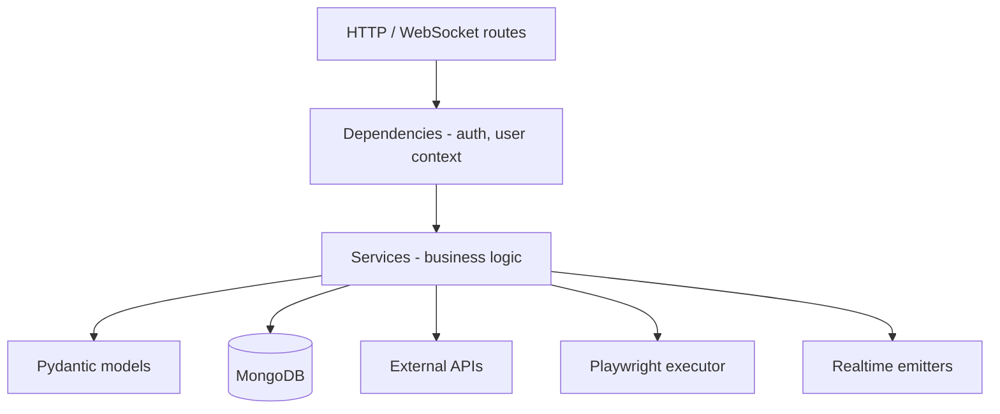

# Backend architecture

## Stack

- **Framework:** FastAPI (async)
- **DB driver:** Motor (async MongoDB)
- **Scheduler:** APScheduler `AsyncIOScheduler`
- **Automation:** Playwright via **subprocess** workers (not in-process)
- **Auth:** JWT access + refresh with server-side refresh token store
- **Optional:** Redis (cache, rate limit, Celery, realtime pub/sub)

**Entry point:** `backend/app/main.py`

## Application lifespan

On startup (`lifespan` context manager):

1. Connect MongoDB (`connect_to_mongo`)
2. Optional Redis (`get_redis`)
3. Ensure indexes on all collections
4. Legacy migration + optional demo user seed
5. `start_scheduler()` — APScheduler + catch-up scans
6. Start realtime Redis subscriber (if enabled)

On shutdown: cancel realtime task, `shutdown_scheduler()`, close Redis, close Mongo.

## Layering



| Layer | Location | Rule |
|-------|----------|------|
| Routes | `app/api/routes/*.py`, `app/auth/routes.py` | Thin: validate input, call service, return response |
| Services | `app/services/**` | Business logic, transactions, orchestration |
| Models | `app/models/**` | Schemas, `from_mongo()` helpers |
| Core | `app/core/**` | Config, cross-cutting infrastructure |

## Middleware (order)

1. `GZipMiddleware`
2. `RateLimitMiddleware` (if enabled)
3. `CORSMiddleware` — origins from `settings.effective_cors_origins` + regex
4. `UserContextMiddleware` — attaches user to logging context

## Authentication

**Module:** `app/auth/`

| Piece | File |
|-------|------|
| JWT create/verify | `jwt_service.py` |
| Login, register, refresh | `routes.py`, `service.py` |
| Bearer dependency | `dependencies.py` → `get_current_user` |
| Password reset OTP | `password_reset_service.py` |
| OAuth (stub) | `oauth_service.py` |

**Flow:**

1. `POST /auth/login` → access + refresh tokens
2. Client sends `Authorization: Bearer <access>`
3. On 401, client `POST /auth/refresh` with refresh token body
4. Refresh tokens hashed in `auth_refresh_tokens` collection; rotated on refresh

## Realtime

**WebSocket:** `WS /ws/realtime?token=<access_jwt>`

- `app/realtime/realtime_router.py` — connect, ping/pong
- `app/realtime/websocket_manager.py` — per-user connection map
- Emitters: `scan_event_service`, `provider_status_stream`, `notification_event_service`

Events include: `scan_started`, `scan_completed`, `jobs_fetched`, `provider_status`, `notification`, `connected`.

## Job discovery core

| Service | Role |
|---------|------|
| `job_service.py` | Discover, store, score, feed, LinkedIn merge |
| `job_sources/*` | Provider adapters |
| `aggregator_service` | Parallel fetch + circuit breaker |
| `scan_runner_service.py` | End-to-end scan for one preference |
| `job_scan_automation_service.py` | Daily automation + reminders |

## Scheduler

See [APScheduler documentation](../scheduling/apscheduler.md).

**File:** `app/services/scheduler_service.py`

## Playwright automation

See [Playwright automation](../automation/playwright-automation.md).

**Facade:** `app/services/automation_service.py`  
**Worker:** `app/automation/browser/worker_cli.py`

## System routes

**File:** `app/api/routes/system.py`

| Endpoint | Notes |
|----------|-------|
| `GET/HEAD /health` | Keep-alive, scheduler label |
| `GET /system/status` | Full dependency check |
| `GET /system/metrics` | Metrics snapshot |
| `GET /logs` | HTML log viewer |
| `POST /internal/cron/scheduled-scans` | `X-Cron-Secret` header |

## Configuration

All settings: `app/core/config.py` (`pydantic-settings`).

Loads `.env.{ENVIRONMENT}` then `.env`.

See [Environment variables](../deployment/environment-variables.md).

## Testing

```text
backend/tests/
├── test_health.py
├── test_cache.py
└── ...
```

Run: `cd backend && pytest`

## Docker production image

- **Dockerfile:** `backend/Dockerfile`
- Installs Python deps + `playwright install --with-deps chromium`
- Uvicorn serves `app.main:app` on port `10000` (Render)

## Related

- [API reference](../api/api-reference.md)
- [MongoDB schema](../database/mongodb-schema.md)
- [Logging](../operations/logging.md)
