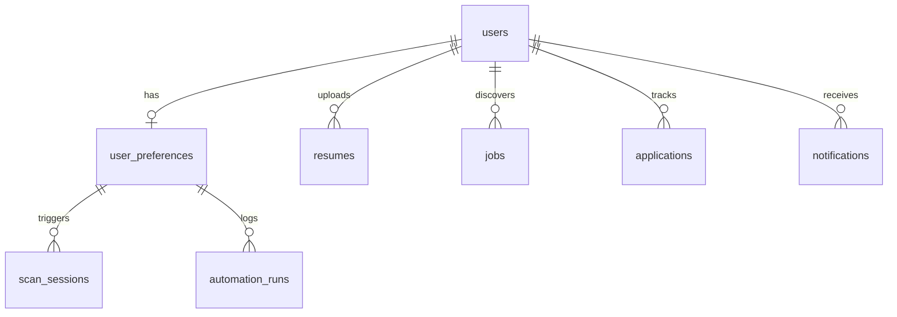

# MongoDB schema

**Database name:** `career_os` (from connection string path)

**Driver:** Motor async — `app/core/database.py`

## Entity relationship (conceptual)

## Collections

| Collection | Service | Primary model | Purpose |
|------------|---------|---------------|---------|
| `users` | `user_service.py` | `UserDocument` | Accounts, email, workspace link |
| `workspaces` | `workspace_service.py` | `WorkspaceDocument` | Multi-tenant boundary |
| `auth_refresh_tokens` | `auth/service.py` | — | Hashed refresh tokens |
| `password_reset_otps` | `password_reset_service.py` | — | OTP reset flow |
| `user_preferences` | `user_preferences_service.py` | `UserPreferencesDocument` | Scan schedule, targets, thresholds |
| `resumes` | `resume_service.py` | `ResumeDocument` | Parsed resume + Cloudinary URL |
| `jobs` | `job_service.py` | `JobDocument` | Discovered listings, scores |
| `scan_sessions` | `scan_session_service.py` | `ScanSessionDocument` | Per-scan metadata + analytics |
| `applications` | `application_service.py` | `ApplicationDocument` | CRM pipeline |
| `notifications` | `notification_service.py` | `NotificationDocument` | In-app alerts |
| `automation_runs` | `notification_service.py` | `AutomationRunDocument` | Scan/automation run logs |
| `career_insights` | `career_insight_service.py` | — | Generated insights |
| `apply_sessions` | `apply_history_service.py` | — | Auto-apply sessions |
| `apply_history` | `apply_history_service.py` | — | Apply attempt history |
| `apply_errors` | `apply_history_service.py` | — | Apply failures |
| `interview_prep_progress` | `prep_progress_service.py` | — | Interview prep state |
| `interview_web_questions_cache` | `web_question_service.py` | — | Cached web questions |
| `copilot_insights` | `insight_memory_service.py` | — | Copilot memory |
| `copilot_sessions` | `insight_memory_service.py` | — | Chat sessions |
| `platform_migrations` | `migration_service.py` | — | One-time migration flags |

## Key document fields

### `user_preferences`

| Field | Type | Notes |
|-------|------|-------|
| `user_id` | string | Unique index |
| `email` | string | Digest recipient |
| `resume_id` | string | **Required for scans** — empty skips scheduled scan |
| `scan_time` | string | `HH:MM` 24h |
| `timezone` | string | e.g. `Asia/Kolkata` |
| `frequency` | string | `daily`, `weekly`, `every_6h`, `custom` |
| `is_active` | bool | Scheduler respects |
| `min_match_threshold` | int | 0–100 |
| `target_roles`, `target_skills`, `target_companies` | array | Search targeting |
| `preferred_locations` | array | Location filter |
| `last_email_sent_at` | ISO string | Dedupe / catch-up logic |
| `last_email_scan_id` | string | Last digest scan |
| `enabled_providers` | array | Provider filter |
| `email_notifications`, `in_app_notifications` | bool | Channels |

### `jobs`

| Field | Notes |
|-------|-------|
| `title`, `company`, `location`, `url` | Core listing |
| `match_percentage` | AI score |
| `provider` | Source id |
| `scan_id`, `scan_timestamp` | Batch grouping |
| `remote_priority`, `india_focused`, `actionable_in_india` | Geo filters |
| `easy_apply`, `is_easy_apply_possible` | Apply UX |

### `applications`

| Field | Notes |
|-------|-------|
| `application_id` | Stable id |
| `job_id` | Link to job |
| `status` | saved, applied, interview, assessment, offer, rejected |
| `applied_at`, `updated_at` | Timeline |

## Indexes

Created on startup via `ensure_*_indexes()` in lifespan.

Examples:

- `user_preferences.user_id` — unique
- `users.email`
- `notifications.created_at` — desc
- `jobs` — compound indexes for feed queries (see `job_service.py`)

## Migrations

**Legacy migration:** `migration_service.run_legacy_data_migration()` assigns orphan data to `LEGACY_MIGRATION_EMAIL` user on first deploy.

**Demo seed:** `AUTH_SEED_DEMO_USERS=true` (dev only; off in `render.yaml`).

## Backup

Script: `infra/backups/mongo_backup.sh` — schedule via cron or Atlas backup.

## Related

- [Job aggregation](../automation/job-aggregation-pipeline.md)
- [APScheduler](../scheduling/apscheduler.md)
