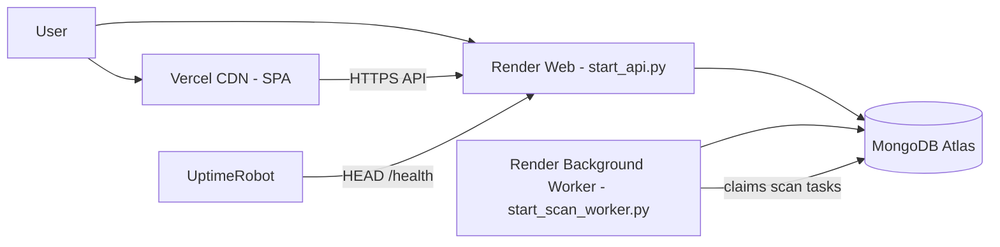

# Render + Vercel deployment

Full step-by-step deploy guide. Also see legacy [DEPLOY.md](../DEPLOY.md) at repo root.

## Architecture



Phase 1B splits scan execution: the **API service** enqueues tasks; the **scan worker** runs APScheduler and executes scans. See [scan execution isolation](../architecture/scan-execution-isolation.md).

## Prerequisites

1. MongoDB Atlas cluster + connection string
2. API keys: Gemini, Resend, Cloudinary
3. GitHub repo connected to Vercel and Render
4. Long random `JWT_SECRET_KEY`

## 1. Backend on Render

### Blueprint (recommended)

1. Render → **New** → **Blueprint** → select `render.yaml`
2. Set secrets in dashboard:

| Variable | Required |
|----------|----------|
| `MONGO_URI` | Yes |
| `JWT_SECRET_KEY` | Yes |
| `FRONTEND_URL` | Yes — exact Vercel URL, no trailing slash |
| `GEMINI_API_KEY` | Yes |
| `RESEND_API_KEY`, `RESEND_FROM_EMAIL` | Yes |
| `CLOUDINARY_*` | Yes |

3. Defaults from blueprint: `REDIS_ENABLED=false`, `CELERY_ENABLED=false`, `ENVIRONMENT=production`
4. **Health check path:** `/health`
5. First Docker build installs Playwright Chromium (**10–20 min** possible)

### Verify backend

```bash
curl -I https://YOUR-SERVICE.onrender.com/health
# HTTP/1.1 200 OK

curl https://YOUR-SERVICE.onrender.com/health
# {"status":"ok","service":"...","scheduler":"running"}
```


## 2. UptimeRobot keep-alive

See [UptimeRobot keep-alive](./uptime-robot-keepalive.md).

- URL: `https://YOUR-SERVICE.onrender.com/health`
- Method: **HEAD** (free tier)
- Interval: 5 minutes
- Timeout: 60 seconds

## 3. Frontend on Vercel

1. Import repo, **Root Directory:** `frontend`
2. Framework: Vite
3. Environment variables (**Production + Preview**):

| Name | Value |
|------|--------|
| `VITE_API_BASE_URL` | `https://YOUR-SERVICE.onrender.com` |
| `VITE_WS_BASE_URL` | `wss://YOUR-SERVICE.onrender.com` |

4. Deploy — `vercel.json` handles SPA routing

**Important:** `VITE_*` are **build-time**. Redeploy after changing them.


## 4. Scan worker background service (Phase 1B)

Deploy a **second Render service** for scan execution so the API stays lightweight.

### Scan worker service

| Setting | Value |
|---------|--------|
| Type | **Background Worker** |
| Root directory | `backend` |
| Build command | Same Docker image as API (or `pip install -r requirements.txt`) |
| Start command | `python start_scan_worker.py` |

Environment (same secrets as API for MongoDB, Gemini, Resend, etc.):

```env
SERVICE_MODE=scan_worker
SCAN_EXECUTION_MODE=dispatch
ENABLE_SCHEDULER=true
ENABLE_REALTIME=false
ENABLE_AUTOMATION=false
SCHEDULER_STARTUP_CATCHUP=false
ENVIRONMENT=production
MONGO_URI=...
```

### API service (update existing web service)

| Setting | Value |
|---------|--------|
| Start command | `python start_api.py` |

```env
SERVICE_MODE=api
SCAN_EXECUTION_MODE=dispatch
ENABLE_SCHEDULER=false
ENABLE_REALTIME=true
ENABLE_AUTOMATION=true
```

### Deployment order

1. MongoDB Atlas reachable from both services
2. Deploy **API** first (users can enqueue; tasks wait in MongoDB)
3. Deploy **scan worker** (claims queued tasks, starts scheduler)

### Expected logs

**API startup:**

```
[STARTUP] Scheduler not started owner=none mode=api ENABLE_SCHEDULER=False
[STARTUP] Runtime profile={'scan_execution_mode': 'dispatch', ...}
```

**Scan worker startup:**

```
[STARTUP] Scheduler owner=scan_worker — scan worker owns APScheduler
[SCHEDULER] Starting APScheduler owner=scan_worker mode=scan_worker
[SCAN_WORKER] loop started worker_id=scan-worker-...
```

**After manual scan from UI:**

```
API:  [SCAN_TASK] queued task_id=stask_...
Worker: [SCAN_TASK] claimed task_id=... dispatch_latency_ms=...
Worker: [SCAN_TASK] started task_id=...
Worker: [SCAN_TASK] completed task_id=...
```

### Verification

```bash
# API health — scheduler should be stopped in dispatch topology
curl https://YOUR-API.onrender.com/health
# "scheduler": "stopped"

# Trigger scan from UI, then poll task status (use task_id from response)
curl -H "Authorization: Bearer TOKEN" \
  https://YOUR-API.onrender.com/scan-tasks/stask_XXXX
```

Worker logs should show claim/start/complete within one poll cycle (~8s default).

## 5. Wire CORS

On Render:

- `FRONTEND_URL=https://your-app.vercel.app`
- `CORS_ORIGIN_REGEX=https://.*\.vercel\.app` (preview deploys)

## 6. Post-deploy checklist

- [ ] `/health` returns 200 (HEAD and GET)
- [ ] Register/login from Vercel URL works
- [ ] Upload resume in Settings / Resume hub
- [ ] Manual scan runs (`POST /run-scan-now`) — returns `status=queued` when dispatch mode; worker completes task
- [ ] Scan worker service running and logging heartbeats
- [ ] WebSocket connects (no infinite invalid-token loop)
- [ ] UptimeRobot monitor green
- [ ] LinkedIn pairing flow works end-to-end:
  - Generate code in Scans & Automation
  - Connect in Career Lens popup
  - Automation page shows `Connected` + `Healthy`
- [ ] Extension API points to production backend (`https://career-os-pd9g.onrender.com`)
- [ ] Production UI fallback is enabled (error boundary redirects users to landing page after 5s)

## Playwright on Render

- Included in `backend/Dockerfile`
- LinkedIn sessions **ephemeral** without persistent disk
- Set `PLAYWRIGHT_HEADLESS=true` in production

## Optional upgrades

| Upgrade | Benefit |
|---------|---------|
| Render Starter ($7) | Less aggressive sleep |
| Render persistent disk | Keep LinkedIn session files |
| Render Redis | Rate limit + Celery + realtime fan-out |

## Local frontend → production API

```bash
cd frontend
cp .env.example .env
# VITE_API_BASE_URL=https://YOUR-SERVICE.onrender.com
npm run dev
```

## Related

- [Environment variables](./environment-variables.md)
- [Production readiness](../production/production-readiness-checklist.md)
- [Troubleshooting](../troubleshooting/common-issues.md)
