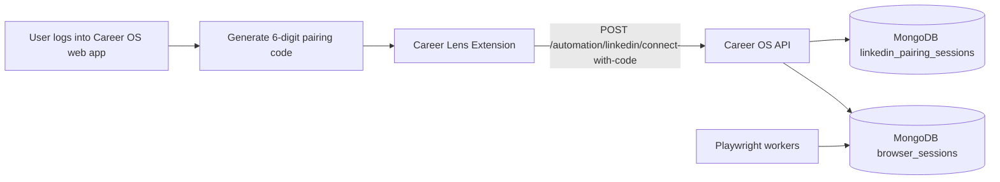

# Career Lens Extension Architecture

## Goal

Career Lens Chrome extension is the official LinkedIn authentication/session bridge for Career OS cloud automation.

It does **not** run scraping, Easy Apply, or AI logic.  
Cloud backend remains the automation engine.

## High-level flow

## Extension components

| File | Responsibility |
|------|----------------|
| `manifest.json` | MV3 config, permissions, host allowlist |
| `popup.html/.js/.css` | Pairing code UI, connect/resync/disconnect |
| `services/linkedin.js` | LinkedIn cookie detection via `chrome.cookies` |
| `services/api.js` | Pairing-code sync call to backend |
| `utils/storage.js` | Fixed production API URL + local sync state |
| `config.js` | Production privacy policy URL (`CAREER_OS_PRIVACY_URL`) |
| `background.js` | Silent session resync (~5h) via `chrome.alarms` |
| `services/sync.js` | Background resync when cookies change or session is stale |
| `services/health.js` | API reachability check for popup banner |
| `services/diagnostics.js` | Copy diagnostics bundle (no secrets) |
| `PRIVACY.md` | Chrome Web Store privacy disclosure (internal); public policy is the web page |

## Backend endpoint

`POST /automation/linkedin/connect-with-code`

- Unauthenticated extension route (JWT never leaves web app)
- Accepts pairing code + LinkedIn cookies + user agent metadata
- Resolves `user_id` via one-time pairing code
- Normalizes cookies into Playwright `storage_state`
- Stores per-user LinkedIn session in `browser_sessions`

## Security model

- No LinkedIn password collection
- No browsing history access
- No cookie values exposed in extension UI
- Minimal extension permissions: `cookies`, `storage`, `tabs`
- Pairing code is 6 digits, expires in 5 minutes, and is one-time use
- Extension never receives or stores Career OS JWT/access token

## Device limitations

- Initial LinkedIn automation setup requires desktop/laptop Chrome (extension install + cookie access).
- Mobile clients can monitor jobs/analytics after setup, but cannot perform first-time LinkedIn pairing.

## Non-goals

- No connector EXE
- No manual JSON upload UX
- No local uploader script
- No content-script scraping engine
