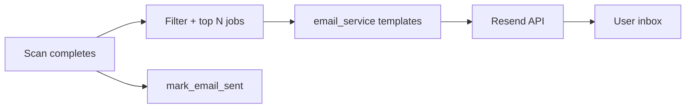

# Email & notifications

## Channels

| Channel | Provider | Use case |
|---------|----------|----------|
| Email | Resend | Scan digests, password reset OTP |
| In-app | MongoDB `notifications` | Alerts, scan complete, high match |
| Realtime toast | WebSocket | Immediate UI feedback |

## Email pipeline

**Service:** `app/services/email_service.py`

**Dedupe:** `user_preferences.last_email_sent_at` + `last_email_scan_id`

## Notification types

Created via `notification_service.create_notification()`:

- Scan complete
- High match batch
- Remote jobs batch
- Follow-up reminders
- Interview reminders
- Weekly insights

**Realtime:** `emit_notification_created` → WebSocket + toast on frontend

## Frontend

| Surface | Component |
|---------|-----------|
| Bell icon | `NotificationCenter.jsx` |
| List page | `Notifications.jsx` |
| Toasts | `RealtimeToastHost.jsx` |

**Service:** `notificationService.js`

## Preferences (Settings)

| Field | Effect |
|-------|--------|
| `email_notifications` | Master email switch |
| `auto_email_on_scan` | Email after each scan |
| `digest_frequency` | daily / weekly |
| `in_app_notifications` | In-app + realtime |
| `high_match_alerts` | Threshold alerts |
| `follow_up_reminders` | 7-day stale applied |

## Resend setup

1. Verify domain or use `onboarding@resend.dev` for testing
2. Set `RESEND_API_KEY` and `RESEND_FROM_EMAIL` on Render

## Password reset email

`POST /auth/password-reset/request` → OTP email  
Dev: `AUTH_DEV_EXPOSE_OTP=true` returns OTP in API response.

## Related

- [Job discovery](./job-discovery.md)
- [Environment variables](../deployment/environment-variables.md)
