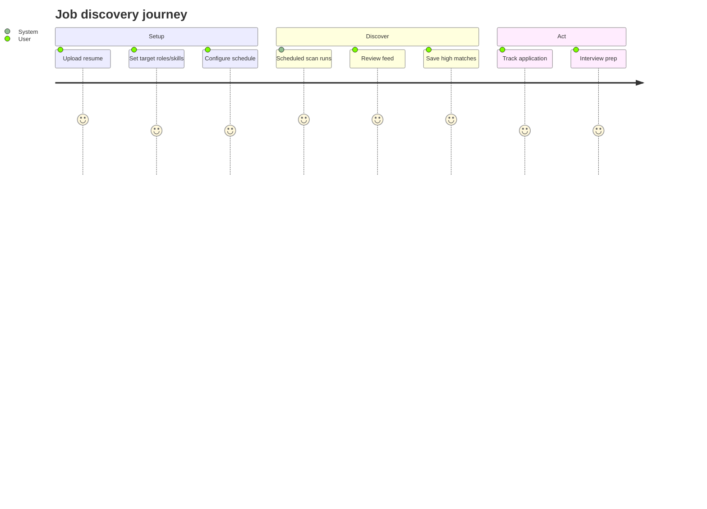

# Job discovery

## User-facing capabilities

- **Unified jobs feed** — Multi-provider listings with match scores, filters, and virtualized grid
- **Job Match** — Paste URL or description for instant resume fit analysis
- **Manual scan** — Run now from Scans page
- **Scheduled scans** — 6-hour or daily per preferences
- **Provider filters** — Enable/disable sources in Settings
- **Realtime progress** — Live timeline during scans

## User journey

## Frontend

| Page | Path |
|------|------|
| Jobs hub → Feed | `src/pages/Jobs.jsx` |
| Jobs hub → Match | `src/pages/JobMatch.jsx` |
| Operations → Scans | `src/pages/Scans.jsx` |
| Settings | `src/pages/Settings.jsx` |

**Services:** `jobService.js`, `scansService.js`, `preferencesService.js`

**Realtime:** `useFeedVersion()` triggers feed refresh on `jobs_fetched` / `scan_completed`

## Backend

| Endpoint | Purpose |
|----------|---------|
| `GET /jobs/feed` | Paginated unified feed |
| `POST /run-scan-now` | Manual scan |
| `GET /scan-analytics/*` | Session stats |

**Pipeline:** [Job aggregation pipeline](../automation/job-aggregation-pipeline.md)

## Configuration (Settings)

- Target roles, skills, companies, locations (tag combobox, limits 50/10)
- `min_match_threshold`
- `remote_only`
- `frequency`, `scan_time`, `timezone`
- `enabled_providers` / `provider_priority`

## Email digest

When `email_notifications` + `auto_email_on_scan` or daily digest: top 15 qualified jobs via Resend.

## Debug mode (dev only)

`DebugSummaryPanel` and Historical Debug Mode on Jobs page — `import.meta.env.DEV` only.

## Related

- [Resume matching](../automation/resume-matching-engine.md)
- [Email notifications](./email-notifications.md)
- [APScheduler](../scheduling/apscheduler.md)
