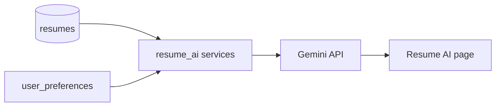

# Resume AI

## Capabilities

| Feature | Description |
|---------|-------------|
| ATS score | Estimate ATS compatibility |
| Keyword analysis | Missing / present keywords vs target role |
| Skill gaps | Compared to job market or JD |
| Feedback | Actionable resume improvements |
| Variants | Role-specific resume versions |
| Align / tailor | Adjust content for a specific JD |
| Export | Download tailored document |

## Frontend

**Page:** `src/pages/ResumeAI.jsx`  
**Components:** `src/components/resumeAi/ResumeAiCharts.jsx`  
**Service:** `src/services/resumeAiService.js`

**Hub:** Resume hub → AI tab (`ResumeHub.jsx`)

## Backend

**Router:** `app/api/routes/resume_ai.py`  
**Services:** `app/services/resume_ai/*`

Prefix: `/resume-ai/`

### Example endpoints

| Method | Path |
|--------|------|
| GET | `/resume-ai/overview` |
| POST | `/resume-ai/ats-score` |
| POST | `/resume-ai/feedback` |
| POST | `/resume-ai/keywords` |
| POST | `/resume-ai/skill-gaps` |
| POST | `/resume-ai/tailor` |
| POST | `/resume-ai/export` |

Requires `GEMINI_API_KEY`.

## Data flow

## Onboarding link

New users may be prompted to upload resume (`ResumeOnboardingContext`) before accessing other hubs.

## Related

- [Resume matching engine](../automation/resume-matching-engine.md)
- [Resume upload UI](../ui/ui-walkthrough.md)
