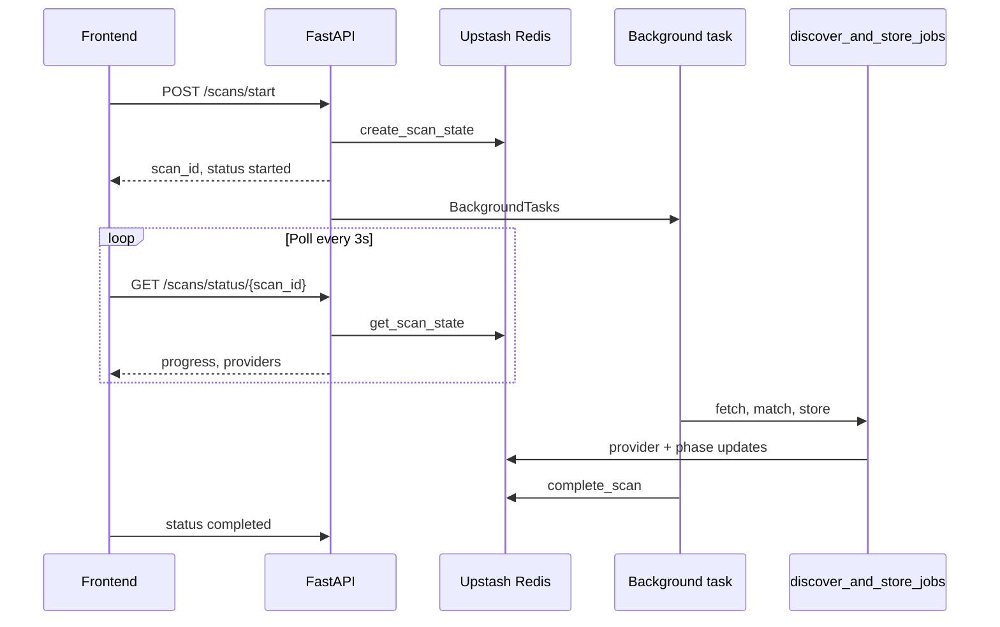

# Background scans (FastAPI BackgroundTasks)

Career OS runs long-running job discovery **asynchronously** so HTTP requests return immediately and the UI polls Redis for progress.

No Celery, RabbitMQ, or external workers — scans run in-process after the response is sent (suitable for Render single-instance; migrate to queues later).

## Architecture



| Component | Path |
|-----------|------|
| Scan state | `app/services/scan_state_service.py` |
| Orchestration | `app/services/background_scan_service.py` |
| API | `app/api/routes/scans.py` |
| Pipeline (unchanged logic) | `discover_and_store_jobs`, `fetch_public_jobs_async`, `aggregate_jobs` |

## Scan lifecycle

1. **started** — `POST /scans/start` creates Redis key `scan:state:{scan_id}` (TTL 1 hour).
2. **fetching** — providers run concurrently (`asyncio.gather` / `as_completed`); each updates Redis.
3. **processing** — resume matching, quality scoring, ranking.
4. **completed** — jobs persisted, scan session saved, caches invalidated, optional email.
5. **failed** — terminal state with `errors[]`; other providers may have succeeded.

## Redis state model

```json
{
  "scan_id": "scan_2026_05_28_12_30",
  "user_id": "...",
  "status": "fetching",
  "progress": 35,
  "current_provider": "naukri",
  "providers": {
    "linkedin": { "name": "linkedin", "status": "completed", "jobs_found": 12, "error": "" },
    "naukri": { "name": "naukri", "status": "running", "jobs_found": 0, "error": "" }
  },
  "providers_completed": ["remoteok", "linkedin"],
  "providers_failed": [],
  "jobs_found": 45,
  "jobs_stored": 0,
  "errors": [],
  "started_at": "2026-05-28T12:30:00+00:00",
  "completed_at": null,
  "result_summary": null
}
```

On **completed**, `result_summary` holds the same payload shape as `POST /fetch-jobs` (plus `email_sent` when requested).

## API

### `POST /scans/start` (auth required)

```json
{
  "resume_id": "optional",
  "preferences_id": "optional",
  "send_email": false
}
```

Response:

```json
{ "scan_id": "scan_2026_05_28_12_30", "status": "started" }
```

### `GET /scans/status/{scan_id}` (auth required)

Returns full state; 404 if unknown or owned by another user.

## Polling flow (frontend)

- `scanBackgroundService.js` — `startBackgroundScan`, `getBackgroundScanStatus`, `pollScanUntilComplete`.
- **Jobs** page — `fetchJobs()` starts background scan and polls (~3s).
- **Scans** page — manual run uses `send_email: true` with `preferences_id`.

Legacy **`POST /fetch-jobs`** and **`POST /run-scan-now`** remain for direct/blocking use (e.g. scripts, Celery path).

## Provider parallelism

- HTTP/RSS providers: concurrent via `asyncio.as_completed` when progress callbacks are enabled.
- LinkedIn Playwright: concurrent with aggregator via `asyncio.gather`.
- One provider failure does not stop others; failures appear in `providers_failed` and `errors`.

## Logging

| Event | Log prefix / `extra.event` |
|-------|----------------------------|
| Scan created | `SCAN_STARTED` / `scan_started` |
| Provider running | `PROVIDER_STARTED` / `provider_started` |
| Provider done | `PROVIDER_COMPLETED` / `provider_completed` |
| Scan success | `SCAN_COMPLETED` / `scan_completed` |
| Scan failure | `SCAN_FAILED` / `scan_failed` |

## Cache interaction

On completion:

- `invalidate_after_scan_complete(user_id)` — dashboard, analytics, jobs feed keys.
- Latest scan summary warmed in `scans:latest:{user_id}` when available.

## Environment

Uses the same **Upstash Redis** variables as response caching (`UPSTASH_REDIS_REST_URL`, `UPSTASH_REDIS_REST_TOKEN`). Without Redis, scan state falls back to in-memory (per instance only).

## Future: queue migration

1. Replace `BackgroundTasks` with Celery/RQ worker consuming `scan.start` messages.
2. Keep **the same Redis state schema** so the frontend polling contract stays stable.
3. Add worker heartbeat and stale-scan recovery (reaper for `fetching` > N minutes).
4. Optional: SSE/WebSocket push instead of polling.

## Verification

1. `POST /scans/start` returns in &lt;1s with `scan_id`.
2. `GET /scans/status/{scan_id}` shows `progress` increasing and providers moving `pending` → `running` → `completed`.
3. After completion, jobs feed and scan analytics match a blocking scan.
4. Key expires after 1 hour (`SCAN_STATE_TTL_SECONDS=3600`).
