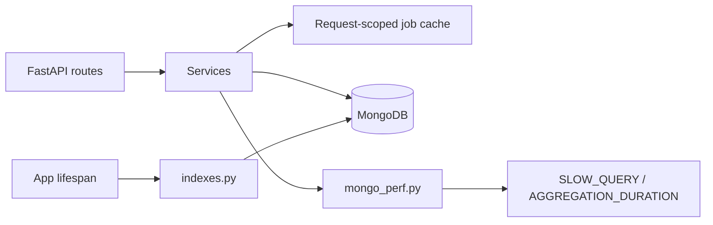

# MongoDB optimization (Career OS)

Indexed, scoped queries for production-scale workloads. API shapes and business logic are unchanged.

## Architecture



| Module | Role |
|--------|------|
| `app/db/indexes.py` | Central index registry + `ensure_all_mongo_indexes()` |
| `app/db/mongo_perf.py` | Slow-query logging, optional explain/COLLSCAN warnings |
| `app/services/job_service.py` | Projections, per-request latest-scan cache |

## Indexes (high-traffic)

### `jobs`

| Index | Use |
|-------|-----|
| `(user_id, created_at ↓)` | History, recency |
| `(user_id, source)` | Provider filters |
| `(user_id, scan_id)` | Scan batches |
| `(user_id, location)` | Location filters |
| `(user_id, title)` | Dedup / search |
| `(source, created_at ↓)` | Provider analytics |
| `(user_id, is_latest_scan)` | **Jobs feed** (latest batch) |

### `scan_sessions`

| Index | Use |
|-------|-----|
| `(user_id, created_at ↓)` | Recent / latest analytics |
| `scan_id` (unique) | Session lookup |
| `(user_id, scan_id)` | User-scoped detail |

### `browser_sessions`

| Index | Use |
|-------|-----|
| `(user_id, platform)` unique | Automation status |

### `users`

| Index | Use |
|-------|-----|
| `email` unique | Login |

### `career_insights` / `applications`

| Index | Use |
|-------|-----|
| `(created_at ↓)` / `(user_id, updated_at ↓)` | Analytics lists |

All collections in `COLLECTION_INDEX_REGISTRY` are ensured once at startup (`INDEX_CREATED` logs).

## Query strategy

1. **Always scope by `user_id`** when data is tenant-specific (`_scoped_query()` in services).
2. **Match + sort on indexed fields** — e.g. latest jobs: `{ user_id, is_latest_scan: true }` + `JOB_SORT_ORDER`.
3. **Projections** — `JOB_READ_PROJECTION` avoids loading unused fields on feed/history/analytics reads.
4. **Limits** — latest scan batch capped at 200; analytics history at `MONGO_ANALYTICS_HISTORY_LIMIT` (default 1500); application analytics capped at 500.
5. **Request-scoped cache** — `get_latest_scan_jobs()` dedupes repeated reads during one HTTP request (career analytics `asyncio.gather`).

## Aggregation / analytics

- Dashboard sections still run in **parallel** (`asyncio.gather`).
- Wall-clock time logged as `AGGREGATION_DURATION` for `career_analytics_dashboard`.
- Sections that called `get_all_jobs()` without limit now use a **bounded** history window (configurable).

## Pagination philosophy

| Endpoint | Cap |
|----------|-----|
| `GET /jobs/history` | `limit` ≤ 100 (service max 500) |
| `GET /scan-analytics/recent` | `limit` ≤ 50 |
| Notifications / copilot | existing `le=` on Query params |

Never return unbounded `to_list(length=None)` on large collections in hot paths.

## Observability

Environment:

| Variable | Default | Purpose |
|----------|---------|---------|
| `MONGO_SLOW_QUERY_MS` | `500` | Log `SLOW_QUERY` when exceeded |
| `MONGO_EXPLAIN_QUERIES` | `false` | Log `mongo_collscan` warnings in dev |
| `MONGO_ANALYTICS_HISTORY_LIMIT` | `1500` | Cap for `get_all_jobs()` analytics |

Log events: `index_created`, `slow_query`, `aggregation_duration`, `mongo_indexes_ready`.

## Startup

```text
connect_to_mongo → ensure_all_mongo_indexes() → …
```

Index creation is **idempotent** (safe on every deploy). Duplicate or conflicting index definitions are caught and logged at debug level.

## Future: sharding

When single-replica CPU or working set exceeds Atlas tier:

1. Shard key candidate: `{ user_id: 1 }` on `jobs` and `scan_sessions`.
2. Keep `scan_id` globally unique or compound unique `{ user_id, scan_id }`.
3. Move cold scan batches to archive collection (`jobs_archive`) with TTL.
4. Pre-aggregate analytics into `analytics_snapshots` collection (nightly job).

Until then, compound indexes + projections + caching meet typical SaaS scale on M10–M30 clusters.

## Verification

1. Restart API — logs show `INDEX_CREATED` per collection (first run).
2. Second startup — indexes skipped quickly (`_INDEX_ENSURED`).
3. Repeat `GET /jobs/feed` — lower latency; one `find` on `(user_id, is_latest_scan)`.
4. Repeat career analytics — fewer duplicate `get_latest_scan_jobs` round-trips per request.
5. Enable `MONGO_EXPLAIN_QUERIES=true` locally — no `COLLSCAN` on latest jobs query.
