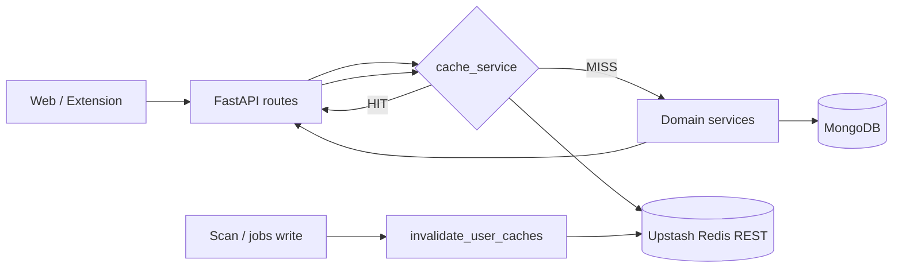

# Redis response caching (Upstash)

Career OS caches expensive read-only API responses in **Upstash Redis** (REST) so repeated dashboard and analytics loads avoid recomputing aggregations on every refresh.

This layer is **response caching only**. It does not replace scanning, job ingestion, or Celery/queue workers.

## Architecture



| Module | Role |
|--------|------|
| `app/services/cache_service.py` | Upstash client, `get_json` / `set_json` / `delete`, in-memory fallback |
| `app/utils/cache_keys.py` | Standard key builders and invalidation prefixes |
| `app/services/cache_invalidation.py` | Hooks after scan, jobs, analytics refresh |

If Upstash is missing or unreachable, the API **continues normally** using an in-process TTL map (per-instance only on Render).

## Environment variables

Set on Render (and locally when testing cache):

| Variable | Description |
|----------|-------------|
| `UPSTASH_REDIS_REST_URL` | Upstash REST endpoint |
| `UPSTASH_REDIS_REST_TOKEN` | Upstash REST token |

Optional TTL override:

| Variable | Default | Purpose |
|----------|---------|---------|
| `CACHE_RESPONSE_TTL` | `300` | Seconds for cached HTTP responses |

Legacy `REDIS_URL` / `REDIS_ENABLED` remain for other features; response caching uses Upstash only.

## Cache keys

| Key pattern | Endpoint / data |
|-------------|-------------------|
| `analytics:user:{user_id}` | Career analytics dashboard (default role) |
| `analytics:user:{user_id}:role:{slug}` | Dashboard for a specific target role |
| `dashboard:user:{user_id}` | `GET /dashboard/summary` |
| `scans:latest:{user_id}` | `GET /scan-analytics/latest` |
| `scans:recent:{user_id}:{limit}` | `GET /scan-analytics/recent` |
| `jobs:user:{user_id}:feed` | `GET /jobs/feed` (no filters) |
| `jobs:user:{user_id}:feed:{hash}` | `GET /jobs/feed` with query filters |

## TTL strategy

- **300 seconds** (`CACHE_RESPONSE_TTL`) for dashboard, career analytics, scan summaries, and jobs feed.
- Stale data is acceptable for a few minutes; invalidation clears keys when underlying data changes.
- Provider-level caches (if any) may use `CACHE_PROVIDER_TTL` separately.

## Invalidation flow

All user-scoped response keys share prefixes listed in `user_cache_prefixes()`.

| Event | Hook | When |
|-------|------|------|
| Scan completes (jobs stored) | `invalidate_after_scan_complete` | End of `discover_and_store_jobs` |
| Jobs inserted (LinkedIn merge) | `invalidate_after_jobs_mutated` | After LinkedIn merge stores jobs |
| Analytics refresh task | `invalidate_after_analytics_refresh` | Celery `refresh_career_insights_task` |

Invalidation uses `KEYS` + `DELETE` on Upstash (best-effort). Failures are logged and do not fail requests.

## Logging

Structured log lines (and `extra.event`):

- `CACHE HIT` / `CACHE MISS` / `CACHE SET`
- `cache_invalidate_*` on invalidation hooks

## Health check

`GET /health` includes:

```json
{ "redis_connected": true }
```

`true` only when Upstash env vars are set **and** `PING` succeeds at startup. `false` still returns `"status": "ok"`.

## Render compatibility

- Use **Upstash Redis** (REST URL + token) in Render environment variables.
- No persistent TCP Redis required for this layer.
- Each web instance has its own in-memory fallback if REST is down.

## Future: queues and workers

Planned next steps (not implemented here):

1. Celery/RQ workers for scan and analytics **generation** (write path).
2. Cache warming after scan completion instead of only invalidation.
3. Optional pub/sub for multi-instance cache coherence beyond prefix delete.

Until then, keep invalidation on every scan/job mutation and rely on 300s TTL for read-heavy paths.

## Local verification

1. Start API without Upstash → `/health` shows `redis_connected: false`; APIs work; logs show `CACHE SET (memory)`.
2. Set `UPSTASH_REDIS_REST_*` → restart → `redis_connected: true`.
3. Load career analytics twice → second request logs `CACHE HIT`.
4. Run a scan → related keys invalidated → next load is `CACHE MISS` then `CACHE SET`.
