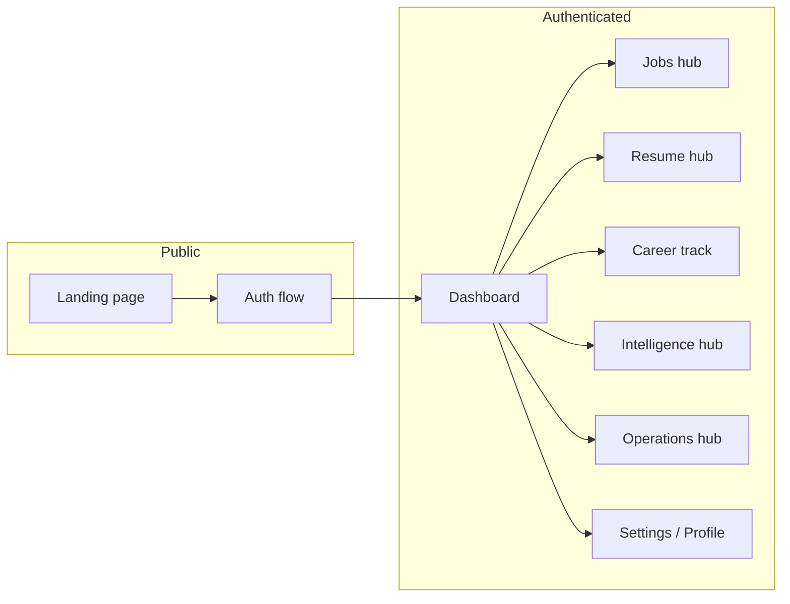

# Product overview

## What is Career OS?

**Career OS** is an AI-powered job discovery and career automation platform built by **ELVA Tech** as part of the **Career Lens** ecosystem. It helps professionals find roles across multiple job boards, score them against their resume, automate recurring scans, track applications, and use AI for resume optimization, interview prep, and career insights.

## Problem statement

Job seekers typically:

- Manually check many boards (LinkedIn, Indeed, Naukri, remote boards, etc.)
- Lose track of applications and follow-ups
- Spend hours tailoring resumes without structured ATS feedback
- Miss optimal scan windows when schedules don’t run reliably

Career OS centralizes discovery, matching, scheduling, notifications, and AI tooling in one dashboard.

## Core value propositions

| Capability | User benefit |
|------------|--------------|
| Multi-provider aggregation | One feed instead of many tabs |
| AI resume matching | Prioritize high-fit roles quickly |
| Scheduled scans | Fresh listings on a 6-hour or daily cadence |
| Email digests | Top matches delivered to inbox |
| Application tracking | Pipeline from saved → applied → interview |
| Resume AI | ATS score, keywords, tailoring |
| Interview prep | Readiness, mock Q&A, plans |
| Career analytics | Salary, skills, market trends |
| Browser automation | LinkedIn session + optional assisted apply |

## Target users

- Active job seekers (India-focused listings with remote/global options)
- Career switchers optimizing resume and interview readiness
- Power users who want scheduled automation without manual refreshes

## Product surfaces

## Feature modules (high level)

| Module | Description |
|--------|-------------|
| **Job discovery** | Aggregate, dedupe, score, feed — [details](../features/job-discovery.md) |
| **Resume AI** | Parse, ATS, keywords, tailor — [details](../features/resume-ai.md) |
| **Applications** | CRM-style pipeline and timeline |
| **Scans & automation** | Manual/scheduled scans, Playwright sessions |
| **Notifications** | In-app + email (Resend) |
| **Interview prep** | AI-generated prep per role |
| **Career analytics** | Dashboards and trends |
| **Copilot** | Conversational assistant over user data |

## Deployment model

- **Frontend:** Vercel (static SPA)
- **API:** Render (Docker, Playwright in image)
- **Database:** MongoDB Atlas
- **Keep-alive:** UptimeRobot `HEAD /health` (free tier)

See [deployment guide](../deployment/render-vercel-deployment.md).

## Screenshots

> Add captures under `docs/assets/screenshots/` per [assets guide](../assets/README.md).

*Marketing landing with sign-in and get-started CTAs.*

*Authenticated dashboard with quick stats and navigation hubs.*

## Related documents

- [Vision and goals](./vision-and-goals.md)
- [UI walkthrough](../ui/ui-walkthrough.md)
- [System architecture](../architecture/system-overview.md)
