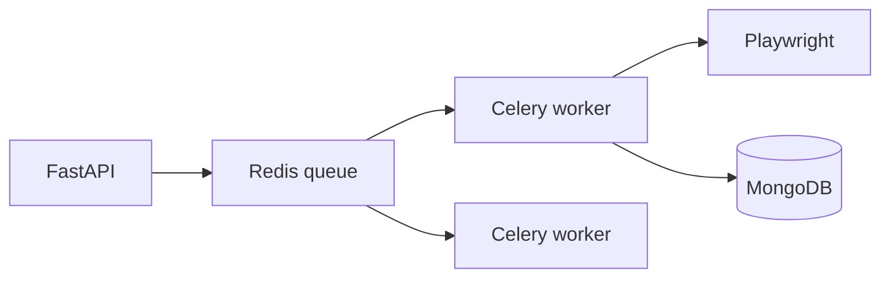

# Scaling strategy

## Current architecture (MVP)

| Tier | Deployment | Scale |
|------|------------|-------|
| Frontend | Vercel CDN | Auto scale static assets |
| API | Single Render container | 1 instance, `WEB_CONCURRENCY=1` |
| DB | MongoDB Atlas | Vertical scale cluster |
| Scheduler | In-process APScheduler | Same container as API |
| Playwright | Subprocess per command | CPU/RAM bound |

**Bottleneck:** Long scans + Chromium on same instance as HTTP.

## Phase 1 — Vertical scale (now)

1. Render **Starter** or higher — more RAM for Playwright
2. Atlas M10+ — indexes already ensured on startup
3. UptimeRobot — reduce cold starts
4. Tune `HEALTH_CACHE_SECONDS`, provider timeouts

**Cost:** Low complexity, acceptable to ~hundreds of active users.

## Phase 2 — Offload heavy work

Enable:

- `REDIS_ENABLED=true` + Render Redis
- `CELERY_ENABLED=true`
- `QUEUE_SCANS_ENABLED=true`
- Separate Render **background worker** service running `celery worker`

**Tasks:** `app/queues/scan_tasks.py`, `scoring_tasks.py`

## Phase 3 — Horizontal API replicas

Requirements before multiple API instances:

1. **Redis pub/sub** for realtime (`publish_realtime_event` all emitters)
2. **Single scheduler leader** — only one instance runs APScheduler OR move schedules to external cron
3. **Sticky sessions not required** — stateless JWT API
4. **Shared session storage** for LinkedIn — S3 or Render persistent disk mount shared (hard) → per-user object storage

## Phase 4 — Data scale

| Technique | When |
|-----------|------|
| Compound indexes on `jobs` feed queries | Slow feed |
| Archive old `jobs` batches | &gt;1M docs |
| Read preference secondary | Read-heavy analytics |
| TTL on `interview_web_questions_cache` | Cache growth |

## Frontend scale

- Vercel handles traffic automatically
- Consider edge caching for static marketing only (app is authenticated)
- API proxy on Vercel reduces client-side blockers

## Cost controls

| Lever | Savings |
|-------|---------|
| Disable unused providers | Fewer HTTP calls |
| Increase scan interval | Less CPU |
| `SCHEDULER_STARTUP_CATCHUP=false` | Faster boots (missed scans until cron) |
| Headless Playwright only | No display server |

## Monitoring at scale

- External APM (Datadog, Sentry) when log volume exceeds Render retention
- Atlas performance advisor
- Queue depth metric when Celery enabled (`/system/status` celery backlog)

## Related

- [Engineering decisions](../engineering/engineering-decisions.md)
- [Production checklist](../production/production-readiness-checklist.md)
