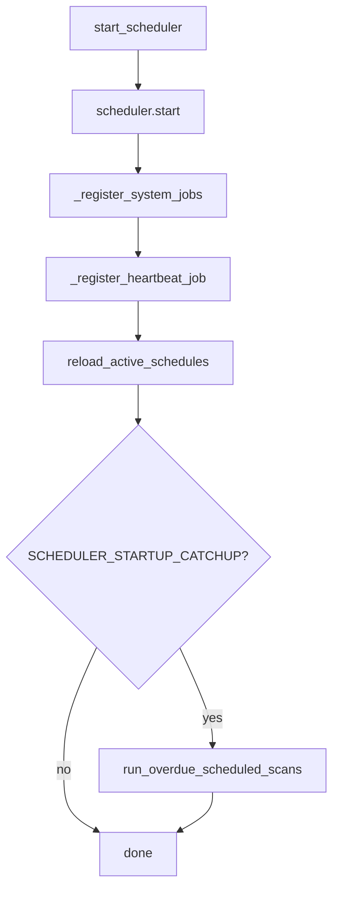

# APScheduler

## Engine

- **Library:** APScheduler 3.x
- **Scheduler class:** `AsyncIOScheduler(timezone="UTC")`
- **Module:** `app/services/scheduler_service.py`
- **Started from:** `app/main.py` lifespan → `start_scheduler()`

## Job types

### Per-user scan jobs

| Property | Value |
|----------|-------|
| Job ID | `scheduled_scan_{preference_id}` |
| Handler | `_execute_scheduled_scan` → `run_daily_job_scan_automation` |
| Trigger | `every_6h` → cron `0,6,12,18` in user TZ; else daily at `scan_time` |
| Guards | Overlap set, `is_active`, **non-empty `resume_id`** |

Preference create/update calls `sync_preference_schedule()`.

### System jobs (UTC)

| Job ID | Schedule | Handler |
|--------|----------|---------|
| `follow_up_reminders` | 09:00 daily | `run_follow_up_reminders` |
| `interview_reminders` | 08:30 daily | `run_interview_reminders` |
| `weekly_career_insights` | Sun 10:00 | `run_weekly_career_insights` |
| `scheduler_heartbeat` | Every 30 min | Logs job counts (if enabled) |

## Startup sequence



## Catch-up logic

`is_preference_due_for_scan()` compares:

- `frequency` (6h / daily / weekly)
- `last_email_sent_at` hours elapsed
- Local time window for scheduled slot

Used by:

- Startup catch-up (`SCHEDULER_STARTUP_CATCHUP=true` default)
- `POST /internal/cron/scheduled-scans` with `X-Cron-Secret`

## Health reporting

`GET /health` returns:

```json
{
  "status": "ok",
  "service": "Career OS API",
  "scheduler": "running"
}
```

`scheduler` is `running` | `stopped` from `get_scheduler_health_snapshot()` (no scheduler init on HEAD).

## Configuration

| Env var | Default | Purpose |
|---------|---------|---------|
| `SCHEDULER_HEARTBEAT_ENABLED` | `true` | 30-min heartbeat log |
| `SCHEDULER_STARTUP_CATCHUP` | `true` | Run overdue scans on boot |
| `CRON_SECRET` | empty | Protect external cron endpoint |

## Render interaction

Free/starter plans **sleep** when idle. Mitigations:

1. UptimeRobot `HEAD /health` every 5 min — [keep-alive guide](../deployment/uptime-robot-keepalive.md)
2. Startup catch-up runs missed scans after wake
3. Frontend `BackendWakeContext` polls `/health` on load

## Shutdown

`shutdown_scheduler()` on app teardown — `wait=False`, clears `_running_scans`.

## Related

- [Job aggregation](../automation/job-aggregation-pipeline.md)
- [Troubleshooting](../troubleshooting/common-issues.md)
