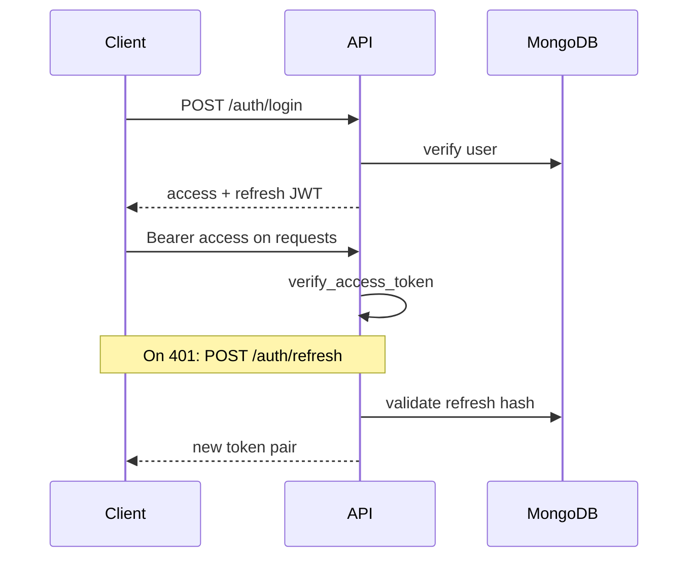

# Security model

## Threat model (summary)

| Asset | Risk | Mitigation |
|-------|------|------------|
| User credentials | Theft | bcrypt passwords, JWT, HTTPS only |
| Refresh tokens | Replay | Server-side hash storage, rotation, revoke on logout |
| API keys | Leak | Backend env only, never in Vite bundle |
| LinkedIn session files | Account takeover | Auth-gated APIs, no public profile paths |
| MongoDB | Unauthorized access | Atlas IP allowlist + strong credentials |
| CORS abuse | CSRF-like calls | Explicit origin allowlist + regex |

## Authentication

- **Access token:** short-lived (default 30 min), sent as `Authorization: Bearer`
- **Refresh token:** long-lived, stored hashed in `auth_refresh_tokens`
- **WebSocket:** access token in query string — use WSS in production

## Authorization

- Most routes: `Depends(get_current_user)`
- Data scoped by `user_id` / `workspace_id` from JWT + `user_context`
- Internal cron: `X-Cron-Secret` header, not user JWT

## Secrets management

| Secret | Location |
|--------|----------|
| `JWT_SECRET_KEY` | Render env only |
| `MONGO_URI` | Render env only |
| Provider keys | Render env only |
| Public config | `VITE_API_BASE_URL` on Vercel |

**Never** commit `.env` files. Rotate `JWT_SECRET_KEY` only with planned user re-login.

## CORS

Configured in `main.py`:

- `settings.effective_cors_origins` — localhost + `FRONTEND_URL` + known Vercel URLs
- `CORS_ORIGIN_REGEX` — preview deploys `*.vercel.app`
- `allow_credentials: true` for cookie-less Bearer pattern

## Rate limiting

`RateLimitMiddleware` when `RATE_LIMIT_ENABLED=true` (requires Redis).

Stricter limits on auth routes — see `rate_limit.py`.

## Playwright / automation

- Subprocess isolation limits blast radius
- Screenshot paths validated against directory traversal
- Session storage under `automation/profiles/` — not web-accessible

## Logging & PII

- Logs include user **email** from context for attribution
- Do not log passwords, tokens, or full OTP in production
- `/logs` viewer is **unauthenticated** today — restrict via network or add auth before public exposure

## Production checklist

- [ ] `AUTH_DEV_EXPOSE_OTP=false`
- [ ] Strong `JWT_SECRET_KEY`
- [ ] Atlas network access restricted
- [ ] HTTPS everywhere (Vercel + Render)
- [ ] `FRONTEND_URL` exact match
- [ ] Review `/logs` exposure

## Related

- [Environment variables](../deployment/environment-variables.md)
- [Troubleshooting](../troubleshooting/common-issues.md)
