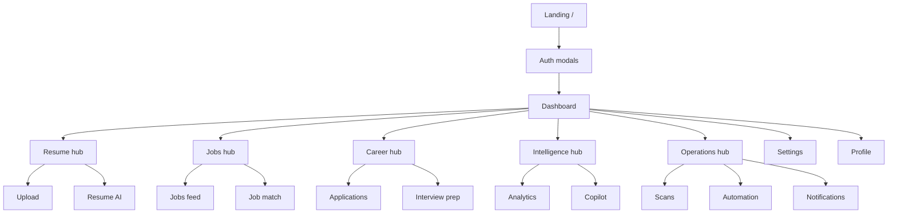

# UI walkthrough

Career OS uses a **hub-based** navigation model with a persistent sidebar (desktop) and bottom nav (mobile).

## Information architecture

## Landing (unauthenticated)

**File:** `LandingPage.jsx`

- Hero: “Find, match, and land your next role”
- CTAs: Sign in, Get started free
- Footer: Career Lens / ELVA Tech links
- Opens `LandingAuthFlow` modal (email → login/register/forgot)

**Wake state:** Blue banner when API cold-starting; `WakeAwareButton` disables Continue until `/health` ok.

## Dashboard

**File:** `DashboardPage.tsx`

- Summary cards (applications, scans, insights)
- Quick links to hubs
- React Query loaded metrics

## Resume hub

| Tab | Page | Actions |
|-----|------|---------|
| Upload | `ResumeUpload.jsx` | PDF/DOCX upload, list resumes |
| AI | `ResumeAI.jsx` | ATS, keywords, tailor |

## Jobs hub

| Tab | Page | Actions |
|-----|------|---------|
| Feed | `Jobs.jsx` | Filter, sort, save, apply modals, paginated grid (6/page) |
| Match | `JobMatch.jsx` | Paste JD URL/text, score |

**Modals:** `JobDetailsModal`, `JobDescriptionModal`, `ApplyAssistantModal`

## Career hub

| Tab | Page |
|-----|------|
| Applications | `Applications.jsx` — pipeline board |
| Interview | `InterviewPrep.jsx` |

## Intelligence hub

| Tab | Page |
|-----|------|
| Analytics | `CareerAnalytics.jsx` |
| Copilot | `CareerCopilot.jsx` — chat UI |

## Operations hub

| Tab | Page |
|-----|------|
| Scans | `Scans.jsx` — schedule, run now, timeline |
| Automation | `Automation.jsx` — LinkedIn session |
| Notifications | `Notifications.jsx` |

## Settings

**File:** `Settings.jsx`

- Scan schedule, timezone, frequency
- Target roles/skills/companies/locations (`TagCombobox`)
- Provider toggles, match threshold
- Notification preferences

## Global UX elements

| Element | Location |
|---------|----------|
| Sidebar | `Sidebar.tsx` — “Career OS” → dashboard |
| Top navbar | `TopNavbar.tsx` — notifications bell |
| User menu | `UserMenu.jsx` — profile, logout |
| Platform tour | `PlatformTour` — first login |
| Resume onboarding | `ResumeOnboardingModal` — new users |
| Realtime toasts | `RealtimeToastHost` |
| PWA install | `PwaInstallPrompt` |

## Mobile

- Sidebar collapses to overlay
- `MobileBottomNav.tsx` — 5 primary hubs
- Modals use top-center placement below header

## Design system

- Dark theme default (neon/glass accents)
- Tailwind utility classes
- shadcn-style `Button`, `Card` in `components/ui/`
- Orange/yellow chart tooltips in analytics

## Related

- [Frontend architecture](../frontend/frontend-architecture.md)
- [Screenshots checklist](../assets/README.md)
